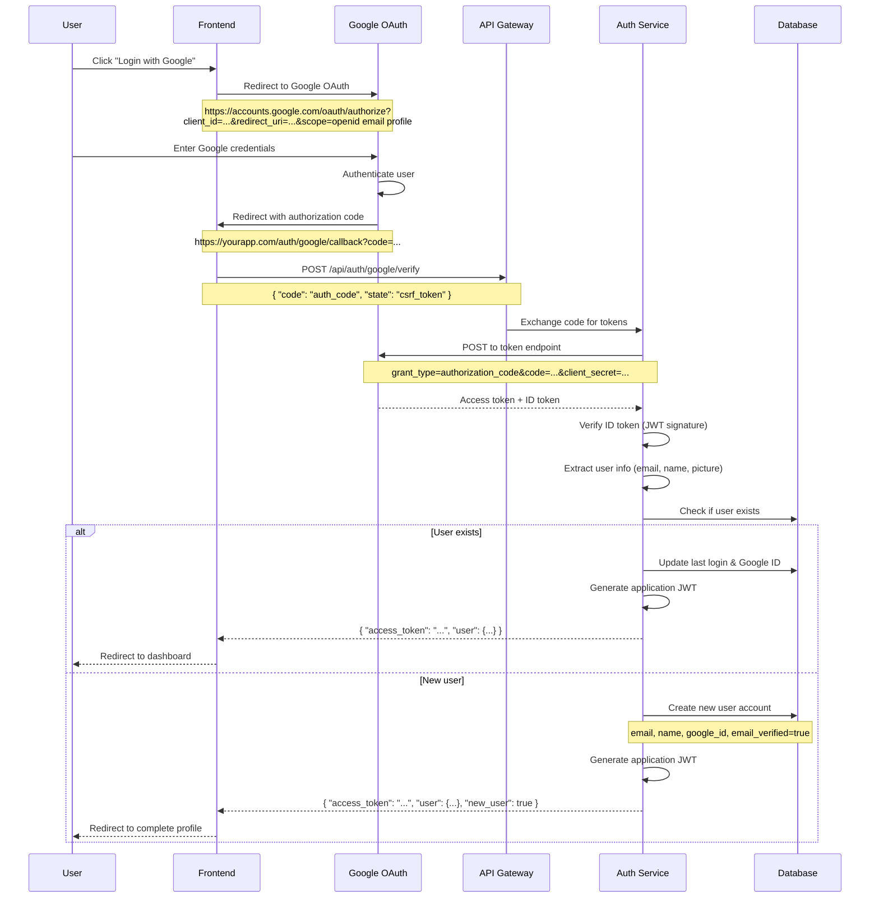
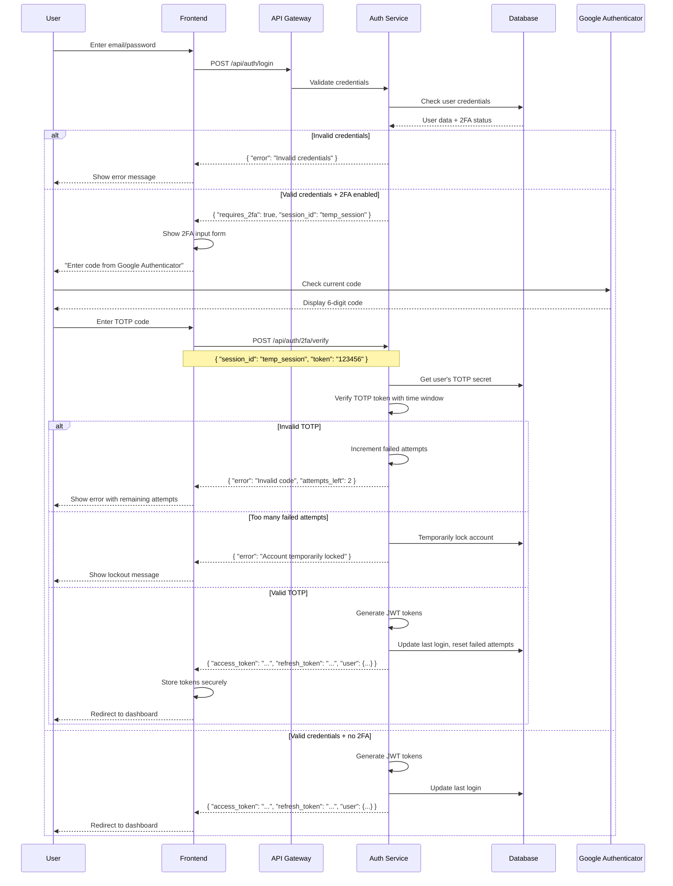

# Arsitektur Sistem CEX (Centralized Exchange) Cryptocurrency
## Panduan Lengkap Implementasi Sistem Trading Profesional

---

## 1. OVERVIEW SISTEM

### 1.1 Komponen Utama Sistem
- **Frontend User Trading Applications** (Web, Mobile, Desktop)
- **Frontend Admin** (Web) Next js
- **API Gateway & Load Balancer**
- **Authentication & Authorization Service**
- **Trading Engine**
- **Order Management System (OMS)**
- **Wallet Management System**
- **Payment Processing System**
- **Risk Management System**
- **Compliance & KYC System**
- **Monitoring & Analytics System**
- **Database Layer**
- **Message Queue System**
- **Blockchain Integration Layer**

### 1.2 Teknologi Stack Rekomendasi
```
Frontend:
- Web: React/Vue.js + TypeScript + WebSocket
- Mobile: React Native/Flutter
- Desktop: Electron

Admin Panel:
- Web: Codeigniter 3 + javascript jquery + html

Backend:
- Core Services: Node.js/Go/Java Spring Boot
- Database: PostgreSQL (primary), Redis (cache) (for order book realtime), MongoDB (logs)
- Message Queue: Apache Kafka/RabbitMQ
- Cache: Redis Cluster
- Search: Elasticsearch
- Monitoring: Prometheus + Grafana
- Container: Docker + Kubernetes
```

---

## 2. ARSITEKTUR TINGKAT TINGGI

```
┌─────────────────────────────────────────────────────────────┐
│                    LOAD BALANCER (NGINX/HAProxy)            │
└─────────────────────┬───────────────────────────────────────┘
                      │
┌─────────────────────┴───────────────────────────────────────┐
│                    API GATEWAY                              │
│              (Kong/AWS API Gateway)                         │
└─────────────────────┬───────────────────────────────────────┘
                      │
      ┌───────────────┼───────────────┐
      │               │               │
┌─────▼─────┐  ┌─────▼─────┐  ┌─────▼─────┐
│  Auth     │  │ Trading   │  │  Wallet   │
│ Service   │  │ Engine    │  │ Service   │
└───────────┘  └───────────┘  └───────────┘
      │               │               │
      └───────────────┼───────────────┘
                      │
┌─────────────────────┴───────────────────────────────────────┐
│                MESSAGE QUEUE (Kafka)                        │
└─────────────────────────────────────────────────────────────┘
                      │
┌─────────────────────┴───────────────────────────────────────┐
│              DATABASE LAYER                                 │
│  ┌─────────────┐ ┌─────────────┐ ┌─────────────┐           │
│  │ PostgreSQL  │ │    Redis    │ │  MongoDB    │           │
│  │  (Primary)  │ │   (Cache)   │ │   (Logs)    │           │
│  └─────────────┘ └─────────────┘ └─────────────┘           │
└─────────────────────────────────────────────────────────────┘
```

---

## 3. SISTEM AUTHENTICATION & AUTHORIZATION

### 3.1 User Registration Flow

```
1. User Registration Request
   ├── Email/Phone Validation
   ├── Password Policy Check
   ├── CAPTCHA Verification
   ├── Terms & Conditions Acceptance
   └── Account Creation

2. Email/SMS Verification
   ├── Send Verification Code (6-digit)
   ├── Code Expiry (15 minutes)
   ├── Max Attempts (3 times)
   └── Account Activation

3. Initial Profile Setup
   ├── Personal Information
   ├── Security Questions
   ├── 2FA Setup (Optional at registration)
   └── Welcome Email
```

### 3.2 Google OAuth Authentication Flow



### 3.3 Google Authenticator 2FA Setup Flow

```mermaid
sequenceDiagram
    participant U as User
    participant F as Frontend
    participant AS as Auth Service
    participant GA as Google Authenticator
    participant DB as Database
    
    U->>F: Navigate to Security Settings
    F->>F: Click "Enable 2FA"
    F->>AS: POST /api/auth/2fa/setup
    
    AS->>AS: Generate secret key (Base32)
    note over AS: secret = base32.encode(random_bytes(20))
    
    AS->>AS: Generate QR code data
    note over AS: otpauth://totp/AppName:user@email.com?<br/>secret=SECRET&issuer=AppName
    
    AS-->>F: { "secret": "...", "qr_code": "data:image/png;base64...", "backup_codes": [...] }
    
    F->>F: Display QR code & backup codes
    F-->>U: Show QR code to scan
    
    U->>GA: Scan QR code
    GA->>GA: Store secret key
    GA-->>U: Display 6-digit code
    
    U->>F: Enter verification code
    F->>AS: POST /api/auth/2fa/verify-setup
    note over F,AS: { "token": "123456" }
    
    AS->>AS: Verify TOTP token
    note over AS: current_time = now()<br/>window = current_time // 30<br/>for i in [-1, 0, 1]:<br/>  test_window = window + i<br/>  expected = HMAC-SHA1(secret, test_window)<br/>  if token == expected: return true
    
    alt Valid token
        AS->>DB: Save 2FA settings
        note over AS,DB: UPDATE users SET totp_secret=encrypted(secret),<br/>two_factor_enabled=true, backup_codes=encrypted(codes)
        AS-->>F: { "success": true, "backup_codes": [...] }
        F-->>U: Show success + backup codes to save
    else Invalid token
        AS-->>F: { "error": "Invalid verification code" }
        F-->>U: Show error, ask to try again
    end
```

### 3.4 Login Flow dengan Google Authenticator



### 3.5 Complete Authentication Methods

```
1. Multiple Authentication Options
   ├── Traditional Email/Password Login
   ├── Google OAuth 2.0 Integration
   ├── Apple Sign-In (iOS)
   ├── Facebook Login (optional)
   ├── LinkedIn OAuth (optional)
   └── Enterprise SSO (SAML/OIDC)

2. Two-Factor Authentication Options
   ├── Google Authenticator (TOTP)
   │   ├── 6-digit codes
   │   ├── 30-second time window
   │   ├── Clock skew tolerance (±30 seconds)
   │   ├── Backup codes (10 single-use codes)
   │   └── QR code setup process
   ├── Authy Support
   │   ├── Cross-device synchronization
   │   ├── Encrypted cloud backup
   │   ├── Multi-device approval
   │   └── Same TOTP standard
   ├── SMS-based 2FA
   │   ├── 6-digit SMS codes
   │   ├── 5-minute expiry
   │   ├── Rate limiting (max 3/hour)
   │   └── International SMS support
   ├── Email-based 2FA
   │   ├── Email verification codes
   │   ├── 15-minute expiry
   │   ├── HTML and text formats
   │   └── Anti-phishing measures
   └── Hardware Security Keys
       ├── FIDO2/WebAuthn standard
       ├── YubiKey support
       ├── Biometric authentication
       └── Backup key requirements

3. Social Login Implementation Details
   ├── Google OAuth 2.0
   │   ├── Scopes: openid, email, profile
   │   ├── Client ID configuration
   │   ├── Redirect URI whitelist
   │   ├── State parameter for CSRF protection
   │   ├── ID token verification
   │   ├── Refresh token handling
   │   └── Account linking with existing users
   ├── Apple Sign-In
   │   ├── Native iOS integration
   │   ├── Web-based authentication
   │   ├── Email relay service handling
   │   ├── Privacy-focused implementation
   │   └── Team ID and Key ID configuration
   ├── Account Linking Logic
   │   ├── Email-based account matching
   │   ├── Manual account linking option
   │   ├── Duplicate account prevention
   │   ├── Social account unlinking
   │   └── Primary authentication method selection

4. Google Authenticator Implementation
   ├── TOTP Algorithm (RFC 6238)
   │   ├── HMAC-SHA1 hash function
   │   ├── 8-byte counter (Unix timestamp / 30)
   │   ├── 6-digit code extraction
   │   ├── Base32 secret key encoding
   │   └── Clock synchronization handling
   ├── Secret Key Management
   │   ├── Cryptographically secure random generation
   │   ├── Per-user unique secrets
   │   ├── Encrypted storage in database
   │   ├── Key rotation capabilities
   │   └── Recovery key backup
   ├── QR Code Generation
   │   ├── otpauth:// URI format
   │   ├── Service name and user identification
   │   ├── Algorithm and digit specification
   │   ├── Period configuration (30 seconds)
   │   └── PNG image generation
   ├── Backup Code System
   │   ├── 10 single-use recovery codes
   │   ├── 8-character alphanumeric codes
   │   ├── Encrypted storage
   │   ├── Usage tracking and invalidation
   │   ├── Regeneration capability
   │   └── Emergency access procedures
   └── Time Synchronization
       ├── Server time synchronization
       ├── Client clock skew tolerance
       ├── Multiple time window validation
       ├── NTP server integration
       └── Time drift monitoring
```

### 3.6 Authentication API Endpoints

```
1. Traditional Authentication
   ├── POST /api/v1/auth/register
   │   ├── Body: { email, password, first_name, last_name, terms_accepted }
   │   ├── Response: { user_id, verification_token, message }
   │   └── Triggers: Welcome email, verification email
   ├── POST /api/v1/auth/verify-email
   │   ├── Body: { token, user_id }
   │   ├── Response: { success, message }
   │   └── Effect: Activates user account
   ├── POST /api/v1/auth/login
   │   ├── Body: { email, password, captcha_token? }
   │   ├── Response: { access_token?, refresh_token?, requires_2fa?, temp_session? }
   │   └── Headers: Set-Cookie for refresh token (httpOnly)
   ├── POST /api/v1/auth/logout
   │   ├── Headers: Authorization: Bearer <token>
   │   ├── Response: { success }
   │   └── Effect: Invalidates tokens, clears cookies

2. Google OAuth Endpoints
   ├── GET /api/v1/auth/google/url
   │   ├── Query: { redirect_uri, state? }
   │   ├── Response: { auth_url, state }
   │   └── Returns: Google OAuth authorization URL
   ├── POST /api/v1/auth/google/callback
   │   ├── Body: { code, state }
   │   ├── Response: { access_token, refresh_token, user, new_user? }
   │   └── Process: Exchange code for tokens, create/login user
   ├── POST /api/v1/auth/google/link
   │   ├── Headers: Authorization: Bearer <token>
   │   ├── Body: { google_token }
   │   ├── Response: { success, google_linked }
   │   └── Effect: Links Google account to existing user

3. Two-Factor Authentication Endpoints
   ├── POST /api/v1/auth/2fa/setup
   │   ├── Headers: Authorization: Bearer <token>
   │   ├── Response: { secret, qr_code, backup_codes }
   │   └── Note: Temporary until verification
   ├── POST /api/v1/auth/2fa/verify-setup
   │   ├── Headers: Authorization: Bearer <token>
   │   ├── Body: { token }
   │   ├── Response: { success, backup_codes }
   │   └── Effect: Enables 2FA permanently
   ├── POST /api/v1/auth/2fa/verify
   │   ├── Body: { temp_session, token }
   │   ├── Response: { access_token, refresh_token, user }
   │   └── Completes: Login process with 2FA
   ├── POST /api/v1/auth/2fa/disable
   │   ├── Headers: Authorization: Bearer <token>
   │   ├── Body: { password, token }
   │   ├── Response: { success }
   │   └── Effect: Disables 2FA
   ├── POST /api/v1/auth/2fa/regenerate-backup
   │   ├── Headers: Authorization: Bearer <token>
   │   ├── Body: { token }
   │   ├── Response: { backup_codes }
   │   └── Effect: Generates new backup codes
   ├── POST /api/v1/auth/2fa/verify-backup
   │   ├── Body: { temp_session, backup_code }
   │   ├── Response: { access_token, refresh_token, user }
   │   └── Note: Single-use backup code

4. Token Management
   ├── POST /api/v1/auth/refresh
   │   ├── Body: { refresh_token } or Cookie
   │   ├── Response: { access_token, refresh_token? }
   │   └── Note: Optional token rotation
   ├── POST /api/v1/auth/revoke
   │   ├── Headers: Authorization: Bearer <token>
   │   ├── Body: { token_type: "access|refresh|all" }
   │   ├── Response: { success }
   │   └── Effect: Revokes specified tokens
   ├── GET /api/v1/auth/sessions
   │   ├── Headers: Authorization: Bearer <token>
   │   ├── Response: [{ session_id, device, location, last_active, current }]
   │   └── Lists: All active user sessions
   ├── DELETE /api/v1/auth/sessions/:session_id
   │   ├── Headers: Authorization: Bearer <token>
   │   ├── Response: { success }
   │   └── Effect: Terminates specific session

5. Password Management
   ├── POST /api/v1/auth/forgot-password
   │   ├── Body: { email }
   │   ├── Response: { success, message }
   │   └── Triggers: Password reset email
   ├── POST /api/v1/auth/reset-password
   │   ├── Body: { token, new_password }
   │   ├── Response: { success }
   │   └── Effect: Updates password, invalidates reset token
   ├── POST /api/v1/auth/change-password
   │   ├── Headers: Authorization: Bearer <token>
   │   ├── Body: { current_password, new_password }
   │   ├── Response: { success }
   │   └── Effect: Updates password, may require re-auth

6. Account Security
   ├── GET /api/v1/auth/security-status
   │   ├── Headers: Authorization: Bearer <token>
   │   ├── Response: { two_factor_enabled, recovery_codes_count, linked_accounts }
   │   └── Returns: Current security configuration
   ├── POST /api/v1/auth/enable-email-notifications
   │   ├── Headers: Authorization: Bearer <token>
   │   ├── Body: { login_alerts, security_alerts, trade_alerts }
   │   ├── Response: { success }
   │   └── Effect: Configures security notifications
```

### 3.7 Implementation Code Examples

```javascript
// Google Authenticator TOTP Implementation
const speakeasy = require('speakeasy');
const QRCode = require('qrcode');

class TOTPService {
  generateSecret(email, serviceName) {
    const secret = speakeasy.generateSecret({
      name: `${serviceName}:${email}`,
      issuer: serviceName,
      length: 20
    });
    
    return {
      secret: secret.base32,
      otpauth_url: secret.otpauth_url
    };
  }

  async generateQRCode(otpauth_url) {
    return await QRCode.toDataURL(otpauth_url);
  }

  verifyToken(token, secret) {
    return speakeasy.totp.verify({
      secret: secret,
      encoding: 'base32',
      token: token,
      window: 1 // Allow ±30 seconds clock skew
    });
  }

  generateBackupCodes() {
    const codes = [];
    for (let i = 0; i < 10; i++) {
      codes.push(this.generateRandomCode(8));
    }
    return codes;
  }

  generateRandomCode(length) {
    const chars = 'ABCDEFGHIJKLMNPQRSTUVWXYZ123456789'; // Excluded similar chars
    let result = '';
    for (let i = 0; i < length; i++) {
      result += chars.charAt(Math.floor(Math.random() * chars.length));
    }
    return result;
  }
}

// Google OAuth Implementation
const { OAuth2Client } = require('google-auth-library');

class GoogleAuthService {
  constructor(clientId, clientSecret, redirectUri) {
    this.client = new OAuth2Client(clientId, clientSecret, redirectUri);
  }

  generateAuthUrl(state) {
    return this.client.generateAuthUrl({
      access_type: 'offline',
      scope: ['openid', 'email', 'profile'],
      state: state
    });
  }

  async exchangeCodeForTokens(code) {
    const { tokens } = await this.client.getToken(code);
    this.client.setCredentials(tokens);
    
    const ticket = await this.client.verifyIdToken({
      idToken: tokens.id_token,
      audience: this.clientId
    });
    
    const payload = ticket.getPayload();
    return {
      google_id: payload.sub,
      email: payload.email,
      name: payload.name,
      picture: payload.picture,
      email_verified: payload.email_verified
    };
  }
}

// Complete Authentication Controller
class AuthController {
  async setupTwoFactor(req, res) {
    const userId = req.user.id;
    const email = req.user.email;
    
    // Generate secret
    const { secret, otpauth_url } = this.totpService.generateSecret(
      email, 
      'CryptoExchange'
    );
    
    // Generate QR code
    const qrCode = await this.totpService.generateQRCode(otpauth_url);
    
    // Generate backup codes
    const backupCodes = this.totpService.generateBackupCodes();
    
    // Store temporary (not activated yet)
    await this.userService.storeTempTOTPSecret(userId, secret, backupCodes);
    
    res.json({
      secret,
      qr_code: qrCode,
      backup_codes: backupCodes
    });
  }

  async verifyTwoFactorSetup(req, res) {
    const { token } = req.body;
    const userId = req.user.id;
    
    const tempSecret = await this.userService.getTempTOTPSecret(userId);
    const isValid = this.totpService.verifyToken(token, tempSecret);
    
    if (!isValid) {
      return res.status(400).json({ error: 'Invalid verification code' });
    }
    
    // Activate 2FA
    await this.userService.activateTwoFactor(userId, tempSecret);
    
    const backupCodes = await this.userService.getBackupCodes(userId);
    
    res.json({ success: true, backup_codes: backupCodes });
  }

  async googleOAuth(req, res) {
    const { code, state } = req.body;
    
    try {
      // Exchange code for user info
      const googleUser = await this.googleAuthService.exchangeCodeForTokens(code);
      
      // Check if user exists
      let user = await this.userService.findByEmail(googleUser.email);
      
      if (!user) {
        // Create new user
        user = await this.userService.createFromGoogle(googleUser);
        
        return res.json({
          access_token: this.jwtService.generateAccessToken(user),
          refresh_token: this.jwtService.generateRefreshToken(user),
          user: user,
          new_user: true
        });
      } else {
        // Update existing user
        await this.userService.linkGoogleAccount(user.id, googleUser.google_id);
        
        // Check if 2FA is enabled
        if (user.two_factor_enabled) {
          const tempSession = this.sessionService.createTempSession(user.id);
          return res.json({
            requires_2fa: true,
            temp_session: tempSession
          });
        }
        
        return res.json({
          access_token: this.jwtService.generateAccessToken(user),
          refresh_token: this.jwtService.generateRefreshToken(user),
          user: user
        });
      }
    } catch (error) {
      res.status(400).json({ error: 'Google authentication failed' });
    }
  }
}
```

### 3.4 Session Management

```
1. JWT Token Structure
   ├── Access Token (15 minutes expiry)
   │   ├── user_id, email, role
   │   ├── permissions array
   │   ├── issued_at, expires_at
   │   └── session_id
   └── Refresh Token (7 days expiry)
       ├── user_id, session_id
       ├── issued_at, expires_at
       └── token_family (for rotation)

2. Token Refresh Flow
   ├── Access token expires
   ├── Frontend detects 401 response
   ├── Automatically use refresh token
   ├── Generate new access token
   ├── Rotate refresh token (optional)
   └── Continue request with new token

3. Session Security
   ├── Device fingerprinting
   ├── IP address tracking
   ├── Geographic location monitoring
   ├── Concurrent session limits
   └── Suspicious activity detection
```

---

## 4. TRADING ENGINE ARCHITECTURE

### 4.1 Order Matching Engine

```
1. Order Processing Pipeline
   ├── Order Validation
   │   ├── User balance check
   │   ├── Market availability
   │   ├── Price/quantity limits
   │   ├── Trading permissions
   │   └── Risk management checks
   ├── Order Book Management
   │   ├── In-memory order book (Redis)
   │   ├── Price-time priority matching
   │   ├── Partial fill support
   │   ├── Order book snapshots
   │   └── Real-time market data
   └── Trade Execution
       ├── Match orders
       ├── Calculate fees
       ├── Update balances
       ├── Generate trade events
       └── Notify users

2. Order Types Support
   ├── Market Orders
   ├── Limit Orders
   ├── Stop Orders
   ├── Stop-Limit Orders
   ├── Fill-or-Kill (FOK)
   ├── Immediate-or-Cancel (IOC)
   ├── Good-Till-Cancelled (GTC)
   └── Good-Till-Date (GTD)
```

### 4.2 Real-time Market Data

```
1. WebSocket Connections
   ├── Order Book Updates
   │   ├── Depth updates (bids/asks)
   │   ├── Best bid/ask prices
   │   ├── Volume changes
   │   └── Price aggregation levels
   ├── Trade Stream
   │   ├── Real-time executed trades
   │   ├── Trade price and volume
   │   ├── Trade direction (buy/sell)
   │   └── Trade timestamp
   ├── Ticker Data
   │   ├── 24h price change
   │   ├── 24h volume
   │   ├── High/low prices
   │   └── Last trade price
   └── Candlestick Data
       ├── OHLCV data
       ├── Multiple timeframes
       ├── Historical data access
       └── Real-time updates

2. Data Distribution
   ├── Fan-out pattern with Redis Streams
   ├── Topic-based subscriptions
   ├── Client connection management
   ├── Bandwidth optimization
   └── Compression (gzip/deflate)
```

### 4.3 Portfolio Management

```
1. Balance Management
   ├── Available Balance
   │   ├── Total balance - locked funds
   │   ├── Real-time updates
   │   └── Multi-currency support
   ├── Locked Balance
   │   ├── Open orders reserves
   │   ├── Pending withdrawals
   │   └── Margin requirements
   └── Balance History
       ├── All balance changes
       ├── Transaction references
       └── Audit trail

2. P&L Calculation
   ├── Realized P&L (from closed positions)
   ├── Unrealized P&L (mark-to-market)
   ├── Fee calculations
   ├── Multi-currency P&L
   └── Historical performance tracking
```

---

## 5. WALLET MANAGEMENT SYSTEM

### 5.1 Multi-Signature Wallet Architecture

```
1. Hot Wallet (Online)
   ├── Purpose: Daily operations, withdrawals
   ├── Security: 2-of-3 multi-signature
   ├── Balance: 5-10% of total funds
   ├── Monitoring: Real-time alerts
   └── Auto-refill from warm wallet

2. Warm Wallet (Semi-offline)
   ├── Purpose: Intermediate storage
   ├── Security: 3-of-5 multi-signature
   ├── Balance: 20-30% of total funds
   ├── Access: Manual approval process
   └── Scheduled transfers to hot wallet

3. Cold Wallet (Offline)
   ├── Purpose: Long-term storage
   ├── Security: 5-of-7 multi-signature
   ├── Balance: 60-75% of total funds
   ├── Access: Air-gapped, hardware security
   └── Quarterly balance reviews
```

### 5.2 Address Generation & Management

```
1. Hierarchical Deterministic (HD) Wallets
   ├── BIP44 standard implementation
   ├── Master seed stored in HSM
   ├── Derivation path: m/44'/coin_type'/account'/change/index
   ├── Address pool management
   └── Address reuse prevention

2. Deposit Address Management
   ├── Unique address per user per currency
   ├── Address generation on-demand
   ├── Address validation and verification
   ├── QR code generation
   └── Address expiration (optional)

3. Blockchain Integration
   ├── Full node connections
   ├── Block confirmation monitoring
   ├── Transaction mempool tracking
   ├── Re-org protection
   └── Network fee estimation
```

---

## 6. DEPOSIT SYSTEM

### 6.1 Cryptocurrency Deposits

```
1. Automatic Crypto Deposit Flow
   ├── User requests deposit address
   ├── System generates unique address
   ├── Display address and QR code
   ├── Blockchain monitoring service detects transaction
   ├── Validate transaction (amount, confirmations)
   ├── Credit user account after required confirmations
   ├── Send notification to user
   └── Update transaction history

2. Confirmation Requirements
   ├── Bitcoin (BTC): 3 confirmations
   ├── Ethereum (ETH): 12 confirmations
   ├── Binance Coin (BNB): 15 confirmations
   ├── Litecoin (LTC): 6 confirmations
   ├── Custom confirmation rules per token
   └── High-value deposit manual review

3. Deposit Monitoring System
   ├── Real-time blockchain scanning
   ├── Webhook notifications from node
   ├── Transaction indexing and storage
   ├── Duplicate transaction prevention
   ├── Failed transaction handling
   └── Compliance screening (AML)
```

### 6.2 Fiat Deposit System

```
1. Bank Transfer Integration
   ├── SWIFT network integration
   ├── Local banking partners
   ├── Reference number generation
   ├── Payment matching system
   ├── Manual reconciliation tools
   └── Multi-currency support

2. Credit/Debit Card Processing
   ├── Payment processor integration (Stripe, etc.)
   ├── 3D Secure authentication
   ├── Fraud detection and prevention
   ├── Chargeback management
   ├── PCI DSS compliance
   └── Dynamic currency conversion

3. Manual Fiat Deposit Process
   ├── User submits deposit request
   ├── Generate unique reference number
   ├── Display bank account details
   ├── User initiates bank transfer
   ├── Finance team monitors incoming transfers
   ├── Match reference number to user account
   ├── Verify transfer amount and sender
   ├── Credit user account
   ├── Send confirmation notification
   └── Update transaction records

4. Alternative Payment Methods
   ├── E-wallet integration (PayPal, Skrill)
   ├── Local payment methods per region
   ├── Cryptocurrency payment cards
   ├── Third-party payment aggregators
   └── Mobile payment solutions
```

---

## 7. WITHDRAWAL SYSTEM

### 7.1 Cryptocurrency Withdrawals

```
1. Withdrawal Request Flow
   ├── User submits withdrawal request
   ├── Validate withdrawal address format
   ├── Check user balance and limits
   ├── Apply withdrawal fees
   ├── Security verification (2FA, email)
   ├── Risk assessment and AML screening
   ├── Queue for processing
   ├── Admin approval (for high amounts)
   ├── Execute blockchain transaction
   ├── Update user balance
   ├── Send transaction confirmation
   └── Monitor transaction status

2. Security Measures
   ├── Withdrawal limits (daily/monthly)
   ├── Whitelist address management
   ├── Cold storage integration
   ├── Multi-signature transaction signing
   ├── Time-based delays for large amounts
   ├── IP address verification
   ├── Device recognition
   └── Suspicious activity alerts

3. Transaction Processing
   ├── Batching small transactions
   ├── Dynamic fee calculation
   ├── Priority processing for premium users
   ├── Failed transaction retry logic
   ├── Blockchain congestion handling
   └── Gas optimization strategies
```

### 7.2 Fiat Withdrawals

```
1. Bank Transfer Withdrawals
   ├── Bank account verification
   ├── IBAN validation
   ├── Beneficiary information storage
   ├── SWIFT message generation
   ├── Compliance checks (OFAC, sanctions)
   ├── Banking partner integration
   ├── Transfer status tracking
   └── Settlement confirmation

2. Manual Processing Workflow
   ├── Withdrawal request validation
   ├── Document verification requirements
   ├── Finance team review queue
   ├── Multi-level approval process
   ├── Bank transfer initiation
   ├── Payment confirmation
   ├── User notification system
   └── Reconciliation process
```

---

## 8. ORDER MANAGEMENT SYSTEM (OMS)

### 8.1 Order Lifecycle Management

```
1. Order States
   ├── NEW: Order received and validated
   ├── PENDING: Waiting for matching
   ├── PARTIALLY_FILLED: Partial execution
   ├── FILLED: Completely executed
   ├── CANCELLED: User cancelled
   ├── REJECTED: Failed validation
   ├── EXPIRED: Time-based expiration
   └── SUSPENDED: Risk management hold

2. Order Processing Pipeline
   ├── Pre-trade Risk Checks
   │   ├── Position limits
   │   ├── Credit limits
   │   ├── Market risk exposure
   │   ├── Regulatory restrictions
   │   └── User trading permissions
   ├── Order Validation
   │   ├── Symbol existence
   │   ├── Market status (open/closed)
   │   ├── Price tick size validation
   │   ├── Minimum order size
   │   └── Maximum order size
   ├── Balance Management
   │   ├── Available balance check
   │   ├── Reserve funds for order
   │   ├── Fee pre-calculation
   │   ├── Margin requirement
   │   └── Cross-currency conversion
   └── Order Book Integration
       ├── Add to order book
       ├── Match against existing orders
       ├── Execute trades
       ├── Update order status
       └── Release unused reserves

3. Advanced Order Features
   ├── Iceberg Orders (hidden quantity)
   ├── Time-in-Force options
   ├── Post-only orders (maker-only)
   ├── Reduce-only orders
   └── Bracket orders (OCO)
```

---

## 9. RISK MANAGEMENT SYSTEM

### 9.1 Real-time Risk Monitoring

```
1. User-Level Risk Controls
   ├── Position Limits
   │   ├── Maximum position size per symbol
   │   ├── Total exposure limits
   │   ├── Concentration risk monitoring
   │   └── Dynamic limit adjustments
   ├── Trading Limits
   │   ├── Daily trading volume limits
   │   ├── Order size restrictions
   │   ├── Number of orders per minute
   │   └── API rate limiting
   ├── Loss Prevention
   │   ├── Daily loss limits
   │   ├── Maximum drawdown monitoring
   │   ├── Automatic position closure
   │   └── Emergency stop mechanisms
   └── Behavioral Analysis
       ├── Unusual trading patterns
       ├── Market manipulation detection
       ├── Wash trading identification
       └── Insider trading surveillance

2. Market-Level Risk Controls
   ├── Circuit Breakers
   │   ├── Price volatility limits
   │   ├── Trading halt mechanisms
   │   ├── Market cooldown periods
   │   └── Gradual market reopening
   ├── Liquidity Monitoring
   │   ├── Order book depth analysis
   │   ├── Spread monitoring
   │   ├── Market maker incentives
   │   └── Liquidity provider management
   └── Systemic Risk Management
       ├── Cross-market correlation analysis
       ├── Flash crash prevention
       ├── Market stress testing
       └── Emergency shutdown procedures

3. Operational Risk Controls
   ├── System Performance Monitoring
   ├── Database integrity checks
   ├── Network connectivity monitoring
   ├── Third-party service health checks
   └── Disaster recovery procedures
```

---

## 10. COMPLIANCE & KYC SYSTEM

### 10.1 Know Your Customer (KYC) Process

```
1. KYC Verification Levels
   ├── Level 0: Basic Registration
   │   ├── Email verification only
   │   ├── Limited trading (demo/testnet)
   │   ├── No withdrawals allowed
   │   └── Educational content access
   ├── Level 1: Identity Verification
   │   ├── Full name and address
   │   ├── Government ID verification
   │   ├── Facial recognition check
   │   ├── Basic trading limits
   │   ├── Small withdrawal limits
   │   └── Standard deposit methods
   ├── Level 2: Enhanced Verification
   │   ├── Proof of address document
   │   ├── Bank statement verification
   │   ├── Source of funds declaration
   │   ├── Higher trading limits
   │   ├── Increased withdrawal limits
   │   └── Access to advanced features
   └── Level 3: Institutional/VIP
       ├── Business registration documents
       ├── Financial statements
       ├── Ultimate beneficial owner info
       ├── Compliance officer details
       ├── Unlimited trading access
       ├── OTC trading eligibility
       └── Dedicated account manager

2. Document Verification Process
   ├── Document Upload Interface
   ├── AI-powered document analysis
   ├── Fraud detection algorithms
   ├── Manual review queue
   ├── Verification status updates
   ├── Document expiration tracking
   └── Re-verification workflows

3. Identity Verification Technologies
   ├── Liveness Detection
   ├── Biometric Matching
   ├── OCR and Data Extraction
   ├── Government Database Checks
   ├── Watchlist Screening
   └── Age Verification
```

### 10.2 Anti-Money Laundering (AML)

```
1. Transaction Monitoring
   ├── Real-time Transaction Screening
   │   ├── Suspicious pattern detection
   │   ├── Velocity checks
   │   ├── Amount threshold monitoring
   │   ├── Geographic risk assessment
   │   └── Peer-to-peer pattern analysis
   ├── Watchlist Screening
   │   ├── OFAC sanctions lists
   │   ├── PEP (Politically Exposed Persons)
   │   ├── Criminal databases
   │   ├── Terrorist financing lists
   │   └── Local regulatory watchlists
   └── Blockchain Analysis
       ├── Address clustering
       ├── Transaction tracing
       ├── Dark web marketplace detection
       ├── Mixer/tumbler identification
       └── Exchange attribution

2. Suspicious Activity Reporting (SAR)
   ├── Automated alert generation
   ├── Case management system
   ├── Investigation workflows
   ├── Regulatory reporting
   ├── False positive management
   └── Audit trail maintenance

3. Compliance Reporting
   ├── Daily transaction reports
   ├── Large transaction reports (CTRs)
   ├── Cross-border transfer reports
   ├── Regulatory examination support
   └── Audit documentation
```

---

## 11. DATABASE ARCHITECTURE

### 11.1 Database Design

```
1. Primary Database (PostgreSQL)
   ├── User Management
   │   ├── users table
   │   ├── user_profiles table
   │   ├── user_security table
   │   ├── user_preferences table
   │   └── user_sessions table
   ├── Financial Data
   │   ├── accounts table
   │   ├── balances table
   │   ├── transactions table
   │   ├── deposits table
   │   ├── withdrawals table
   │   └── fee_schedules table
   ├── Trading Data
   │   ├── markets table
   │   ├── orders table
   │   ├── trades table
   │   ├── order_history table
   │   └── market_data table
   ├── Compliance Data
   │   ├── kyc_documents table
   │   ├── kyc_verifications table
   │   ├── aml_alerts table
   │   └── compliance_reports table
   └── System Data
       ├── audit_logs table
       ├── system_config table
       ├── notifications table
       └── scheduled_jobs table

2. Cache Layer (Redis)
   ├── Session Data
   ├── Order Books (in-memory)
   ├── Market Data Cache
   ├── Rate Limiting Counters
   ├── Authentication Tokens
   ├── User Preferences
   └── Temporary Data Storage

3. Analytics Database (ClickHouse/MongoDB)
   ├── Trading Analytics
   ├── User Behavior Data
   ├── Performance Metrics
   ├── Market Analysis Data
   └── Compliance Analytics
```

### 11.2 Data Consistency & ACID Properties

```
1. Transaction Management
   ├── Database transactions for critical operations
   ├── Two-phase commit for distributed transactions
   ├── Saga pattern for long-running processes
   ├── Eventual consistency for non-critical data
   └── Conflict resolution strategies

2. Data Replication
   ├── Master-slave replication setup
   ├── Read replicas for analytics
   ├── Geographic distribution
   ├── Failover mechanisms
   └── Data synchronization monitoring
```

---

## 12. PAYMENT PROCESSING SYSTEM

### 12.1 Payment Gateway Integration

```
1. Multi-Gateway Architecture
   ├── Primary Gateway For Indonesian Country (YUKK, MITRANDS DLL)
   ├── Backup Gateway (PayPal/Adyen)
   ├── Regional Gateways
   ├── Cryptocurrency Processors
   └── Gateway routing logic

2. Payment Flow
   ├── Payment Method Validation
   ├── Fraud Detection Screening
   ├── 3D Secure Authentication
   ├── Payment Processing
   ├── Settlement Confirmation
   ├── Chargeback Management
   └── Refund Processing

3. Fee Management
   ├── Dynamic fee calculation
   ├── Volume-based discounts
   ├── Maker-taker fee model
   ├── Withdrawal fee optimization
   └── Fee transparency reporting
```

---

## 13. API DESIGN & MANAGEMENT

### 13.1 RESTful API Architecture

```
1. API Endpoints Structure
   ├── Authentication: /api/v1/auth/*
   ├── User Management: /api/v1/users/*
   ├── Trading: /api/v1/trading/*
   ├── Wallet: /api/v1/wallet/*
   ├── Market Data: /api/v1/market/*
   ├── Compliance: /api/v1/compliance/*
   └── Admin: /api/v1/admin/*

2. API Security
   ├── JWT token authentication
   ├── API key management
   ├── Rate limiting per endpoint
   ├── Request signing (HMAC)
   ├── IP whitelisting
   ├── CORS configuration
   └── SSL/TLS encryption

3. API Documentation
   ├── OpenAPI 3.0 specification
   ├── Interactive API explorer
   ├── Code examples in multiple languages
   ├── SDK generation and maintenance
   └── API versioning strategy
```

### 13.2 WebSocket API for Real-time Data

```
1. WebSocket Channels
   ├── Order Book Updates: orderbook.{symbol}
   ├── Trade Stream: trades.{symbol}
   ├── Ticker Data: ticker.{symbol}
   ├── User Orders: user.orders
   ├── User Balances: user.balances
   └── System Announcements: system.announcements

2. Connection Management
   ├── Authentication via JWT
   ├── Heartbeat/ping-pong mechanism
   ├── Automatic reconnection logic
   ├── Subscription management
   ├── Message queuing during disconnection
   └── Connection pool management

3. Data Compression & Optimization
   ├── Message batching
   ├── Delta updates only
   ├── Gzip compression
   ├── Binary message format (MessagePack)
   └── Client-side caching
```

---

## 14. SECURITY ARCHITECTURE

### 14.1 Application Security

```
1. Input Validation & Sanitization
   ├── SQL injection prevention
   ├── XSS protection
   ├── CSRF token implementation
   ├── Parameter tampering protection
   └── File upload security

2. Encryption Standards
   ├── AES-256 for data at rest
   ├── TLS 1.3 for data in transit
   ├── RSA/ECDSA for digital signatures
   ├── PBKDF2/bcrypt for password hashing
   └── Hardware Security Modules (HSM)

3. Access Control
   ├── Role-based access control (RBAC)
   ├── Principle of least privilege
   ├── Multi-factor authentication
   ├── Session management
   └── API access controls
```

### 14.2 Infrastructure Security

```
1. Network Security
   ├── WAF (Web Application Firewall)
   ├── DDoS protection
   ├── VPN access for admin
   ├── Network segmentation
   ├── Intrusion detection systems
   └── Regular penetration testing

2. Server Security
   ├── OS hardening
   ├── Regular security updates
   ├── Antivirus/anti-malware
   ├── File integrity monitoring
   ├── Log aggregation and analysis
   └── Backup and disaster recovery

3. Container Security
   ├── Image scanning
   ├── Runtime protection
   ├── Secret management
   ├── Network policies
   └── Resource limits
```

---

## 15. MONITORING & LOGGING

### 15.1 System Monitoring

```
1. Infrastructure Monitoring
   ├── CPU, Memory, Disk usage
   ├── Network performance
   ├── Database performance
   ├── Application response times
   ├── Error rates and patterns
   └── Third-party service health

2. Business Metrics Monitoring
   ├── Trading volume and activity
   ├── User registrations and activity
   ├── Revenue and fee collection
   ├── Deposit/withdrawal statistics
   ├── System availability metrics
   └── Customer support metrics

3. Alerting System
   ├── Real-time alert notifications
   ├── Escalation procedures
   ├── Alert fatigue management
   ├── Incident response workflows
   └── Post-incident analysis
```

### 15.2 Logging Architecture

```
1. Log Categories
   ├── Application logs
   ├── Access logs
   ├── Security logs
   ├── Audit logs
   ├── Trade execution logs
   └── System performance logs

2. Log Management
   ├── Centralized log aggregation
   ├── Log parsing and indexing
   ├── Log retention policies
   ├── Log analysis and reporting
   ├── Compliance log requirements
   └── Log security and integrity

3. Analytics and Reporting
   ├── Real-time dashboards
   ├── Custom report generation
   ├── Trend analysis
   ├── Anomaly detection
   └── Business intelligence integration
```

---

## 16. SCALABILITY & PERFORMANCE

### 16.1 Horizontal Scaling Strategy

```
1. Microservices Architecture
   ├── Service decomposition
   ├── Inter-service communication
   ├── Service discovery
   ├── Load balancing
   ├── Circuit breaker pattern
   └── Distributed tracing

2. Database Scaling
   ├── Read replicas
   ├── Sharding strategies
   ├── Connection pooling
   ├── Query optimization
   ├── Caching layers
   └── Database partitioning

3. Cache Strategy
   ├── Multi-level caching
   ├── Cache invalidation
   ├── Cache warming
   ├── Distributed caching
   └── Cache monitoring
```

### 16.2 Performance Optimization

```
1. Application Performance
   ├── Code profiling and optimization
   ├── Database query optimization
   ├── Memory management
   ├── Garbage collection tuning
   ├── Asynchronous processing
   └── Resource pooling

2. Frontend Optimization
   ├── Code splitting and lazy loading
   ├── CDN distribution
   ├── Image optimization
   ├── Minification and compression
   ├── Service worker implementation
   └── Progressive Web App features

3. Network Optimization
   ├── HTTP/2 implementation
   ├── Connection keep-alive
   ├── Compression algorithms
   ├── Edge caching
   └── Geographic distribution
```

---

## 17. DISASTER RECOVERY & BUSINESS CONTINUITY

### 17.1 Backup Strategy

```
1. Data Backup
   ├── Database Backups
   │   ├── Daily full backups
   │   ├── Hourly incremental backups
   │   ├── Transaction log backups (every 15 minutes)
   │   ├── Cross-region backup replication
   │   └── Backup integrity verification
   ├── Wallet Backups
   │   ├── Private key backups (encrypted)
   │   ├── HD wallet seed backups
   │   ├── Multi-location storage
   │   ├── Hardware security modules
   │   └── Split-knowledge procedures
   └── Configuration Backups
       ├── Application configurations
       ├── Infrastructure as Code
       ├── SSL certificates
       ├── API keys and secrets
       └── Deployment scripts

2. Recovery Procedures
   ├── Recovery Time Objective (RTO): 4 hours
   ├── Recovery Point Objective (RPO): 15 minutes
   ├── Automated failover procedures
   ├── Manual recovery workflows
   ├── Data consistency checks
   └── Business resumption testing
```

### 17.2 High Availability Architecture

```
1. Multi-Region Deployment
   ├── Active-Active configuration
   ├── Geographic load balancing
   ├── Data synchronization
   ├── Regional compliance requirements
   └── Latency optimization

2. Failover Mechanisms
   ├── Database failover (Master-Slave)
   ├── Application server failover
   ├── Load balancer health checks
   ├── DNS failover configuration
   └── Monitoring and alerting

3. Redundancy Planning
   ├── No single points of failure
   ├── N+1 redundancy for critical services
   ├── Geographic distribution
   ├── Third-party service alternatives
   └── Communication redundancy
```

---

## 18. REGULATORY COMPLIANCE

### 18.1 Global Compliance Framework

```
1. Regional Regulations
   ├── United States (FinCEN, SEC, CFTC)
   │   ├── Money Services Business (MSB) license
   │   ├── State-by-state licensing requirements
   │   ├── Bank Secrecy Act compliance
   │   ├── OFAC sanctions compliance
   │   └── Securities law compliance
   ├── European Union (MiCA, 5AMLD)
   │   ├── Virtual Asset Service Provider (VASP) license
   │   ├── GDPR compliance
   │   ├── PSD2 requirements
   │   ├── Anti-money laundering directives
   │   └── Consumer protection regulations
   ├── Asia-Pacific
   │   ├── Japan (JVCEA, FSA)
   │   ├── Singapore (MAS)
   │   ├── Hong Kong (SFC)
   │   ├── Australia (AUSTRAC)
   │   └── South Korea (FSC)
   └── Other Jurisdictions
       ├── Canada (FINTRAC)
       ├── United Kingdom (FCA)
       ├── Switzerland (FINMA)
       └── Middle East regulations

2. Compliance Monitoring
   ├── Regulatory change tracking
   ├── Legal consultation processes
   ├── Compliance officer responsibilities
   ├── Regular compliance audits
   ├── Regulatory reporting schedules
   └── License renewal procedures
```

### 18.2 Data Protection & Privacy

```
1. GDPR Compliance
   ├── Data minimization principles
   ├── Consent management systems
   ├── Right to be forgotten implementation
   ├── Data portability features
   ├── Privacy impact assessments
   ├── Data processing agreements
   └── Breach notification procedures

2. Data Localization Requirements
   ├── Geographic data storage requirements
   ├── Cross-border data transfer restrictions
   ├── Local data processing requirements
   ├── Government data access provisions
   └── Data sovereignty considerations

3. User Privacy Protection
   ├── Anonymization techniques
   ├── Pseudonymization methods
   ├── Encryption standards
   ├── Access logging and monitoring
   └── Third-party data sharing controls
```

---

## 19. CUSTOMER SUPPORT SYSTEM

### 19.1 Multi-Channel Support

```
1. Support Channels
   ├── Live Chat Integration
   │   ├── 24/7 availability
   │   ├── Multi-language support
   │   ├── AI chatbot for tier-1 issues
   │   ├── Queue management system
   │   └── Chat history and context
   ├── Ticket System
   │   ├── Priority-based routing
   │   ├── SLA tracking and monitoring
   │   ├── Escalation procedures
   │   ├── Internal collaboration tools
   │   └── Customer satisfaction surveys
   ├── Phone Support
   │   ├── VoIP integration
   │   ├── Call recording and monitoring
   │   ├── Interactive voice response (IVR)
   │   ├── Call back functionality
   │   └── Agent performance metrics
   └── Community Forums
       ├── User-generated content moderation
       ├── Expert community members
       ├── FAQ and knowledge base
       ├── Community rewards program
       └── Integration with support tickets

2. Knowledge Management
   ├── Comprehensive FAQ database
   ├── Video tutorial library
   ├── Step-by-step guides
   ├── API documentation
   ├── Troubleshooting resources
   └── Multi-language content

3. Support Analytics
   ├── Response time metrics
   ├── Resolution rate tracking
   ├── Customer satisfaction scores
   ├── Agent performance analysis
   ├── Common issue identification
   └── Support cost optimization
```

---

## 20. MOBILE APPLICATION ARCHITECTURE

### 20.1 Cross-Platform Development

```
1. Technology Stack
   ├── Framework: React Native/Flutter
   ├── State Management: Redux/MobX
   ├── Navigation: React Navigation
   ├── Charts: Victory Native/FL Chart
   ├── WebSocket: Socket.io-client
   ├── Security: Keychain/Keystore
   └── Push Notifications: Firebase

2. Feature Parity
   ├── Complete trading functionality
   ├── Portfolio management
   ├── Market data and charts
   ├── Account management
   ├── Security settings
   ├── Deposit/withdrawal flows
   └── Customer support integration

3. Mobile-Specific Features
   ├── Biometric authentication
   ├── Push notification alerts
   ├── Offline mode capabilities
   ├── QR code scanning
   ├── Touch ID/Face ID integration
   ├── Location-based services
   └── Mobile-optimized UI/UX
```

### 20.2 Security Considerations

```
1. Mobile Security
   ├── Certificate pinning
   ├── Root/jailbreak detection
   ├── App tampering protection
   ├── Secure key storage
   ├── Screen recording prevention
   ├── Debug detection
   └── Binary obfuscation

2. Offline Security
   ├── Local data encryption
   ├── Secure session storage
   ├── Cache security measures
   ├── Biometric verification
   └── Auto-logout timers
```

---

## 21. ANALYTICS & REPORTING

### 21.1 Business Intelligence

```
1. Trading Analytics
   ├── Volume and liquidity metrics
   ├── Price movement analysis
   ├── Market maker performance
   ├── Order book depth analysis
   ├── Trading pattern identification
   ├── Arbitrage opportunity detection
   └── Market manipulation surveillance

2. User Analytics
   ├── User acquisition and retention
   ├── Trading behavior analysis
   ├── Feature usage statistics
   ├── User journey mapping
   ├── Conversion funnel analysis
   ├── Churn prediction modeling
   └── Customer lifetime value

3. Financial Analytics
   ├── Revenue and fee analysis
   ├── Profitability by user segment
   ├── Cost analysis and optimization
   ├── Risk-adjusted returns
   ├── Cash flow management
   └── Budget vs. actual reporting

4. Operational Analytics
   ├── System performance metrics
   ├── API usage statistics
   ├── Support ticket analysis
   ├── Compliance reporting
   ├── Security incident tracking
   └── Infrastructure cost optimization
```

### 21.2 Reporting Framework

```
1. Automated Reporting
   ├── Daily operational reports
   ├── Weekly business reviews
   ├── Monthly financial statements
   ├── Quarterly compliance reports
   ├── Annual audit preparations
   └── Real-time dashboard updates

2. Custom Report Generation
   ├── Ad-hoc query interface
   ├── Report scheduling system
   ├── Multi-format exports (PDF, Excel, CSV)
   ├── Email distribution lists
   ├── Report template management
   └── Data visualization tools

3. Regulatory Reporting
   ├── Suspicious Activity Reports (SARs)
   ├── Currency Transaction Reports (CTRs)
   ├── Large Cash Transaction Reports
   ├── Cross-border movement reports
   ├── Tax reporting (1099-B, etc.)
   └── Audit trail documentation
```

---

## 22. TESTING STRATEGY

### 22.1 Comprehensive Testing Framework

```
1. Unit Testing
   ├── Code coverage targets (>80%)
   ├── Test-driven development practices
   ├── Mock and stub implementations
   ├── Automated test execution
   ├── Continuous integration integration
   └── Performance benchmarking

2. Integration Testing
   ├── API endpoint testing
   ├── Database integration tests
   ├── Third-party service integration
   ├── Message queue testing
   ├── End-to-end workflow testing
   └── Contract testing between services

3. Performance Testing
   ├── Load testing scenarios
   ├── Stress testing under peak loads
   ├── Scalability testing
   ├── Database performance testing
   ├── Network latency testing
   └── Memory leak detection

4. Security Testing
   ├── Penetration testing
   ├── Vulnerability scanning
   ├── Authentication bypass testing
   ├── Input validation testing
   ├── Session management testing
   └── Encryption verification

5. User Acceptance Testing
   ├── Trading scenario testing
   ├── Deposit/withdrawal workflows
   ├── KYC process validation
   ├── Mobile app functionality
   ├── Cross-browser compatibility
   └── Accessibility compliance
```

### 22.2 Testing Environments

```
1. Development Environment
   ├── Local development setup
   ├── Mock external services
   ├── Test data management
   ├── Feature flag testing
   └── Developer sandbox

2. Staging Environment
   ├── Production-like configuration
   ├── Full integration testing
   ├── Performance benchmarking
   ├── Security scanning
   └── User acceptance testing

3. Production Environment
   ├── Blue-green deployments
   ├── Canary releases
   ├── A/B testing framework
   ├── Feature flags management
   └── Rollback procedures
```

---

## 23. DEPLOYMENT & DEVOPS

### 23.1 CI/CD Pipeline

```
1. Continuous Integration
   ├── Automated builds on commit
   ├── Unit test execution
   ├── Code quality checks
   ├── Security vulnerability scanning
   ├── Docker image building
   ├── Artifact storage
   └── Notification systems

2. Continuous Deployment
   ├── Infrastructure as Code (Terraform)
   ├── Container orchestration (Kubernetes)
   ├── Automated deployment pipelines
   ├── Environment-specific configurations
   ├── Database migration scripts
   ├── Health check validations
   └── Rollback mechanisms

3. Release Management
   ├── Feature flag management
   ├── Canary deployments
   ├── Blue-green deployments
   ├── Release notes generation
   ├── Stakeholder communications
   └── Post-deployment monitoring
```

### 23.2 Infrastructure Management

```
1. Container Orchestration
   ├── Kubernetes cluster management
   ├── Service mesh implementation (Istio)
   ├── Pod autoscaling
   ├── Resource limits and quotas
   ├── Network policies
   ├── Secret management
   └── Storage orchestration

2. Cloud Infrastructure
   ├── Multi-cloud strategy
   ├── Auto-scaling groups
   ├── Load balancer configuration
   ├── CDN setup and management
   ├── DNS management
   ├── SSL certificate automation
   └── Cost optimization strategies

3. Monitoring and Observability
   ├── Application Performance Monitoring (APM)
   ├── Distributed tracing
   ├── Centralized logging
   ├── Metrics collection and alerting
   ├── Service dependency mapping
   └── Chaos engineering practices
```

---

## 24. THIRD-PARTY INTEGRATIONS

### 24.1 Essential Service Integrations

```
1. Payment Processors
   ├── Stripe: Credit card processing
   ├── PayPal: Alternative payments
   ├── Adyen: Global payment processing
   ├── Circle: USD Coin integration
   ├── Paxos: Stablecoin services
   └── Local banking partners

2. Identity Verification
   ├── Jumio: Document verification
   ├── Onfido: Identity verification
   ├── Trulioo: Global identity verification
   ├── Thomson Reuters: Enhanced due diligence
   └── Chainalysis: Blockchain analysis

3. Market Data Providers
   ├── CoinGecko API: Price aggregation
   ├── CoinMarketCap: Market data
   ├── Kaiko: Professional market data
   ├── Binance API: Liquidity aggregation
   └── Custom price oracles

4. Communication Services
   ├── Twilio: SMS and voice services
   ├── SendGrid: Email delivery
   ├── Firebase: Push notifications
   ├── Zendesk: Customer support
   └── Intercom: Live chat and messaging

5. Security Services
   ├── Cloudflare: DDoS protection and CDN
   ├── Auth0: Authentication as a service
   ├── HashiCorp Vault: Secret management
   ├── CrowdStrike: Endpoint protection
   └── Qualys: Vulnerability scanning
```

### 24.2 Blockchain Infrastructure

```
1. Node Infrastructure
   ├── Self-hosted full nodes
   ├── Third-party node providers (Infura, Alchemy)
   ├── Multi-blockchain support
   ├── Node monitoring and failover
   ├── Custom blockchain indexing
   └── WebSocket connections for real-time data

2. DeFi Protocol Integration
   ├── Uniswap: DEX liquidity
   ├── Compound: Lending protocols
   ├── Aave: Yield farming opportunities
   ├── Chainlink: Price oracle services
   └── Custom smart contract interactions
```

---

## 25. OPERATIONAL PROCEDURES

### 25.1 Daily Operations

```
1. Daily Operational Checklist
   ├── System health monitoring
   ├── Trading engine status verification
   ├── Wallet balance reconciliation
   ├── Pending deposit/withdrawal review
   ├── Customer support queue management
   ├── Security alert review
   ├── Compliance flag investigations
   ├── Market maker performance analysis
   └── Financial reconciliation processes

2. Incident Response Procedures
   ├── Incident detection and alerting
   ├── Initial assessment and classification
   ├── Response team activation
   ├── Communication protocols
   ├── Resolution and recovery steps
   ├── Post-incident analysis
   ├── Documentation and reporting
   └── Process improvement recommendations

3. Change Management
   ├── Change request procedures
   ├── Impact assessment protocols
   ├── Approval workflows
   ├── Implementation scheduling
   ├── Rollback procedures
   ├── Communication plans
   └── Post-change validation
```

### 25.2 Maintenance Procedures

```
1. Scheduled Maintenance
   ├── Database optimization and cleanup
   ├── Index rebuilding and statistics updates
   ├── Log file rotation and archival
   ├── Security patch deployment
   ├── Certificate renewal procedures
   ├── Backup verification and testing
   ├── Performance tuning activities
   └── Capacity planning assessments

2. Emergency Procedures
   ├── System shutdown procedures
   ├── Emergency contact lists
   ├── Crisis communication plans
   ├── Data protection measures
   ├── Legal and regulatory notifications
   ├── Customer communication templates
   └── Business continuity activation
```

---

## 26. PERFORMANCE BENCHMARKS

### 26.1 System Performance Targets

```
1. Trading Engine Performance
   ├── Order processing: <10ms latency
   ├── Market data distribution: <50ms
   ├── Order book updates: <5ms
   ├── Trade execution: <100ms end-to-end
   ├── WebSocket message delivery: <20ms
   ├── Throughput: 100,000+ orders/second
   └── Availability: 99.95% uptime

2. API Performance Targets
   ├── REST API response time: <200ms (95th percentile)
   ├── Authentication: <100ms
   ├── Balance queries: <50ms
   ├── Order placement: <150ms
   ├── Market data: <30ms
   ├── Rate limiting: 1000 requests/minute per user
   └── Concurrent connections: 100,000+

3. Database Performance
   ├── Query response time: <100ms (95th percentile)
   ├── Transaction throughput: 10,000+ TPS
   ├── Connection pool efficiency: >90%
   ├── Cache hit ratio: >95%
   ├── Backup completion: <4 hours
   └── Recovery time: <1 hour

4. Security Response Times
   ├── Fraud detection: Real-time (<1 second)
   ├── Suspicious activity alerts: <5 minutes
   ├── Security incident response: <15 minutes
   ├── Account lockout: Immediate
   ├── Password reset: <2 minutes
   └── 2FA verification: <30 seconds
```

---

## 27. COST OPTIMIZATION STRATEGIES

### 27.1 Infrastructure Cost Management

```
1. Cloud Cost Optimization
   ├── Right-sizing instances based on usage
   ├── Reserved instance planning
   ├── Spot instance utilization
   ├── Auto-scaling configurations
   ├── Storage tier optimization
   ├── CDN usage optimization
   ├── Network transfer cost reduction
   └── Multi-cloud cost comparison

2. Operational Cost Reduction
   ├── Automated manual processes
   ├── Self-service customer features
   ├── Efficient support ticket routing
   ├── Predictive maintenance scheduling
   ├── Energy-efficient data centers
   ├── License optimization
   └── Vendor contract negotiations

3. Development Cost Efficiency
   ├── Code reusability frameworks
   ├── Automated testing procedures
   ├── DevOps automation
   ├── Open-source technology adoption
   ├── Offshore development partnerships
   └── Continuous delivery practices
```

---

## 28. FUTURE SCALABILITY PLANNING

### 28.1 Growth Planning

```
1. User Growth Scenarios
   ├── 10x user growth: Architecture modifications
   ├── Geographic expansion: Multi-region deployment
   ├── Product diversification: Service mesh adoption
   ├── Regulatory changes: Compliance system scaling
   ├── Market volatility: Trading engine enhancement
   └── Competition response: Feature development

2. Technology Evolution
   ├── Blockchain technology adoption
   ├── Artificial intelligence integration
   ├── Quantum-resistant cryptography
   ├── Edge computing implementation
   ├── 5G network optimization
   └── Decentralized finance (DeFi) integration

3. Business Model Evolution
   ├── Institutional trading services
   ├── Cryptocurrency lending
   ├── Staking services
   ├── NFT marketplace
   ├── Cross-chain trading
   └── White-label solutions
```

---

## 29. ADMIN PANEL ARCHITECTURE

### 29.1 Admin Panel Backend API Endpoints

```
1. Authentication & Authorization Endpoints
   ├── POST /api/v1/admin/auth/login
   │   ├── Body: { email, password, 2fa_token? }
   │   ├── Response: { access_token, refresh_token, admin_profile }
   │   └── Features: Admin-specific 2FA, IP restriction
   ├── POST /api/v1/admin/auth/logout
   ├── POST /api/v1/admin/auth/refresh
   ├── GET /api/v1/admin/auth/profile
   └── PUT /api/v1/admin/auth/profile

2. User Management Endpoints
   ├── GET /api/v1/admin/users
   │   ├── Query: { page, limit, search, status, kyc_level, sort }
   │   ├── Response: { users[], total, pagination }
   │   └── Features: Advanced filtering, export capabilities
   ├── GET /api/v1/admin/users/{user_id}
   │   ├── Response: Complete user profile with sensitive data
   │   └── Includes: KYC status, trading history, compliance flags
   ├── PUT /api/v1/admin/users/{user_id}/status
   │   ├── Body: { status: "active|suspended|banned", reason, notes }
   │   └── Effects: Account suspension/activation, notification
   ├── POST /api/v1/admin/users/{user_id}/notes
   │   ├── Body: { note_type, content, priority }
   │   └── Features: Admin note tracking, audit trail
   ├── GET /api/v1/admin/users/{user_id}/audit-trail
   │   ├── Response: Complete user activity history
   │   └── Includes: Logins, trades, deposits, withdrawals, changes
   ├── PUT /api/v1/admin/users/{user_id}/limits
   │   ├── Body: { daily_limit, monthly_limit, single_tx_limit }
   │   └── Features: Custom limit overrides
   ├── POST /api/v1/admin/users/{user_id}/force-logout
   │   └── Effects: Invalidate all user sessions
   └── GET /api/v1/admin/users/statistics
       ├── Response: User growth metrics, activity stats
       └── Features: Date range filtering, chart data

3. Trading Management Endpoints
   ├── GET /api/v1/admin/trading/orders
   │   ├── Query: { user_id?, symbol?, status?, date_from, date_to }
   │   ├── Response: { orders[], statistics, summary }
   │   └── Features: Real-time updates, bulk actions
   ├── GET /api/v1/admin/trading/orders/{order_id}
   │   ├── Response: Detailed order information
   │   └── Includes: Execution details, fee breakdown
   ├── PUT /api/v1/admin/trading/orders/{order_id}/cancel
   │   ├── Body: { reason, notify_user }
   │   └── Effects: Force cancel order, audit logging
   ├── GET /api/v1/admin/trading/trades
   │   ├── Query: { user_id?, symbol?, date_range, min_amount }
   │   └── Features: Trade analysis, pattern detection
   ├── POST /api/v1/admin/trading/halt-market
   │   ├── Body: { symbol, duration, reason }
   │   └── Effects: Emergency market halt
   ├── POST /api/v1/admin/trading/resume-market
   │   ├── Body: { symbol, gradual_resume? }
   │   └── Effects: Market reopening procedures
   ├── GET /api/v1/admin/trading/market-statistics
   │   ├── Response: Volume, liquidity, spread analytics
   │   └── Features: Real-time market health monitoring
   └── GET /api/v1/admin/trading/suspicious-activities
       ├── Response: Flagged trading patterns
       └── Includes: Wash trading, pump & dump detection

4. Market Pair Management Endpoints
   ├── GET /api/v1/admin/market-pairs
   │   ├── Response: All trading pairs with status
   │   └── Includes: Active/inactive pairs, configuration
   ├── POST /api/v1/admin/market-pairs
   │   ├── Body: { base_currency, quote_currency, config }
   │   ├── Config: { min_order_size, max_order_size, price_precision, quantity_precision }
   │   └── Features: Dynamic pair creation
   ├── PUT /api/v1/admin/market-pairs/{pair_id}
   │   ├── Body: Updated pair configuration
   │   └── Features: Live configuration updates
   ├── POST /api/v1/admin/market-pairs/{pair_id}/activate
   │   ├── Effects: Enable trading for pair
   │   └── Features: Gradual rollout options
   ├── POST /api/v1/admin/market-pairs/{pair_id}/deactivate
   │   ├── Body: { reason, cancel_existing_orders }
   │   └── Effects: Disable trading, handle existing orders
   ├── GET /api/v1/admin/market-pairs/{pair_id}/statistics
   │   ├── Response: Pair-specific trading statistics
   │   └── Includes: Volume, spreads, maker/taker ratios
   ├── PUT /api/v1/admin/market-pairs/{pair_id}/fees
   │   ├── Body: { maker_fee, taker_fee, withdrawal_fee }
   │   └── Features: Dynamic fee adjustments
   └── GET /api/v1/admin/market-pairs/performance
       ├── Response: Cross-pair performance analysis
       └── Features: Liquidity comparison, profitability

5. Financial Management Endpoints
   ├── GET /api/v1/admin/finance/deposits
   │   ├── Query: { status, currency, user_id, amount_range }
   │   ├── Response: { deposits[], statistics, pending_actions }
   │   └── Features: Manual approval workflow
   ├── PUT /api/v1/admin/finance/deposits/{deposit_id}/approve
   │   ├── Body: { notes, credit_amount? }
   │   └── Effects: Credit user account, notifications
   ├── PUT /api/v1/admin/finance/deposits/{deposit_id}/reject
   │   ├── Body: { reason, refund_required }
   │   └── Features: Rejection workflow, refund processing
   ├── GET /api/v1/admin/finance/withdrawals
   │   ├── Query: { status, currency, user_id, approval_required }
   │   └── Features: Multi-level approval system
   ├── PUT /api/v1/admin/finance/withdrawals/{withdrawal_id}/approve
   │   ├── Body: { approval_level, notes }
   │   └── Features: Sequential approval process
   ├── PUT /api/v1/admin/finance/withdrawals/{withdrawal_id}/reject
   │   ├── Body: { reason, refund_funds }
   │   └── Effects: Return funds, user notification
   ├── GET /api/v1/admin/finance/balances
   │   ├── Response: Platform-wide balance summary
   │   └── Includes: Hot/cold wallet balances, reserves
   ├── POST /api/v1/admin/finance/manual-adjustment
   │   ├── Body: { user_id, currency, amount, reason, type }
   │   └── Features: Manual balance adjustments, audit trail
   ├── GET /api/v1/admin/finance/reconciliation
   │   ├── Response: Daily reconciliation reports
   │   └── Features: Automated vs manual reconciliation
   └── GET /api/v1/admin/finance/fee-analysis
       ├── Response: Fee collection analytics
       └── Features: Revenue analysis, optimization suggestions

6. Compliance & KYC Management Endpoints
   ├── GET /api/v1/admin/compliance/kyc-queue
   │   ├── Query: { status, priority, assigned_to, document_type }
   │   ├── Response: { applications[], workload_distribution }
   │   └── Features: Assignment system, SLA tracking
   ├── GET /api/v1/admin/compliance/kyc/{application_id}
   │   ├── Response: Complete KYC application with documents
   │   └── Includes: Document analysis results, verification status
   ├── PUT /api/v1/admin/compliance/kyc/{application_id}/review
   │   ├── Body: { status, comments, required_documents, tier_level }
   │   └── Effects: Update KYC status, user notifications
   ├── POST /api/v1/admin/compliance/kyc/{application_id}/request-documents
   │   ├── Body: { document_types[], message }
   │   └── Features: Document re-submission workflow
   ├── GET /api/v1/admin/compliance/aml-alerts
   │   ├── Query: { severity, status, date_range, user_id }
   │   ├── Response: { alerts[], risk_scores, recommendations }
   │   └── Features: Alert prioritization, case management
   ├── PUT /api/v1/admin/compliance/aml-alerts/{alert_id}/investigate
   │   ├── Body: { assigned_to, priority, notes }
   │   └── Features: Investigation workflow tracking
   ├── POST /api/v1/admin/compliance/aml-alerts/{alert_id}/close
   │   ├── Body: { resolution, actions_taken, follow_up_required }
   │   └── Effects: Close investigation, generate reports
   ├── GET /api/v1/admin/compliance/watchlist
   │   ├── Response: Sanctioned entities, PEP lists
   │   └── Features: List management, update tracking
   ├── POST /api/v1/admin/compliance/sar-filing
   │   ├── Body: { user_id, transaction_ids[], suspicious_activity, amount }
   │   └── Features: Suspicious Activity Report generation
   └── GET /api/v1/admin/compliance/reports
       ├── Query: { report_type, date_range, jurisdiction }
       └── Features: Automated compliance report generation

7. System Management Endpoints
   ├── GET /api/v1/admin/system/health
   │   ├── Response: Overall system health status
   │   └── Includes: Service status, performance metrics
   ├── GET /api/v1/admin/system/monitoring
   │   ├── Response: Real-time system monitoring data
   │   └── Features: Performance graphs, alert history
   ├── POST /api/v1/admin/system/maintenance
   │   ├── Body: { maintenance_type, scheduled_time, duration, message }
   │   └── Features: Scheduled maintenance announcements
   ├── GET /api/v1/admin/system/audit-logs
   │   ├── Query: { admin_id, action_type, date_range, resource }
   │   └── Features: Complete admin action tracking
   ├── POST /api/v1/admin/system/notifications/broadcast
   │   ├── Body: { message, target_users, priority, channels }
   │   └── Features: Mass user notifications
   ├── GET /api/v1/admin/system/configuration
   │   ├── Response: System configuration parameters
   │   └── Includes: Trading limits, fees, security settings
   ├── PUT /api/v1/admin/system/configuration
   │   ├── Body: Configuration updates
   │   └── Features: Live configuration updates, rollback
   └── GET /api/v1/admin/system/backup-status
       ├── Response: Backup job status and history
       └── Features: Backup verification, restore capabilities

8. Risk Management Endpoints
   ├── GET /api/v1/admin/risk/dashboard
   │   ├── Response: Risk management overview
   │   └── Includes: Portfolio risk, user risk scores
   ├── GET /api/v1/admin/risk/user-limits
   │   ├── Query: { user_id?, risk_level, limit_type }
   │   └── Features: Dynamic risk-based limiting
   ├── PUT /api/v1/admin/risk/user-limits/{user_id}
   │   ├── Body: { daily_limit, monthly_limit, single_tx_limit }
   │   └── Features: Manual limit overrides
   ├── GET /api/v1/admin/risk/market-risk
   │   ├── Response: Market-wide risk analysis
   │   └── Includes: Concentration risk, volatility metrics
   ├── POST /api/v1/admin/risk/emergency-stop
   │   ├── Body: { scope: "user|market|system", reason }
   │   └── Effects: Emergency trading halt
   └── GET /api/v1/admin/risk/scenarios
       ├── Response: Risk scenario analysis
       └── Features: Stress testing, scenario modeling

9. Analytics & Reporting Endpoints
   ├── GET /api/v1/admin/analytics/dashboard
   │   ├── Response: Executive dashboard data
   │   └── Includes: KPIs, trends, comparative analysis
   ├── GET /api/v1/admin/analytics/user-metrics
   │   ├── Query: { metric_type, date_range, segment }
   │   └── Features: User behavior analysis, cohort analysis
   ├── GET /api/v1/admin/analytics/trading-metrics
   │   ├── Response: Trading performance metrics
   │   └── Includes: Volume trends, pair performance
   ├── GET /api/v1/admin/analytics/revenue
   │   ├── Query: { breakdown_by, date_range, currency }
   │   └── Features: Revenue analysis, forecasting
   ├── POST /api/v1/admin/analytics/custom-report
   │   ├── Body: { report_config, filters, output_format }
   │   └── Features: Ad-hoc report generation
   └── GET /api/v1/admin/analytics/export/{report_id}
       ├── Response: Downloadable reports (PDF, Excel, CSV)
       └── Features: Scheduled report delivery
```

### 29.2 Admin Panel Frontend Architecture 

```
1. Admin Panel Directory Structure
application/
├── controllers/
│   ├── Admin.php (Base admin controller)
│   ├── admin/
│   │   ├── Dashboard.php
│   │   ├── Users.php
│   │   ├── Trading.php
│   │   ├── Markets.php
│   │   ├── Finance.php
│   │   ├── Compliance.php
│   │   ├── System.php
│   │   ├── Risk.php
│   │   ├── Analytics.php
│   │   └── Settings.php
├── models/
│   ├── admin/
│   │   ├── Admin_user_model.php
│   │   ├── Trading_model.php
│   │   ├── Market_pair_model.php
│   │   ├── Finance_model.php
│   │   ├── Compliance_model.php
│   │   ├── System_model.php
│   │   ├── Risk_model.php
│   │   └── Analytics_model.php
├── views/
│   ├── admin/
│   │   ├── layouts/
│   │   │   ├── header.php
│   │   │   ├── sidebar.php
│   │   │   ├── footer.php
│   │   │   └── main.php
│   │   ├── dashboard/
│   │   │   └── index.php
│   │   ├── users/
│   │   │   ├── index.php
│   │   │   ├── detail.php
│   │   │   ├── edit.php
│   │   │   └── audit_trail.php
│   │   ├── trading/
│   │   │   ├── orders.php
│   │   │   ├── trades.php
│   │   │   ├── market_control.php
│   │   │   └── suspicious_activities.php
│   │   ├── markets/
│   │   │   ├── pairs.php
│   │   │   ├── add_pair.php
│   │   │   ├── edit_pair.php
│   │   │   └── statistics.php
│   │   ├── finance/
│   │   │   ├── deposits.php
│   │   │   ├── withdrawals.php
│   │   │   ├── balances.php
│   │   │   └── reconciliation.php
│   │   ├── compliance/
│   │   │   ├── kyc_queue.php
│   │   │   ├── kyc_review.php
│   │   │   ├── aml_alerts.php
│   │   │   └── reports.php
│   │   ├── system/
│   │   │   ├── monitoring.php
│   │   │   ├── configuration.php
│   │   │   ├── audit_logs.php
│   │   │   └── maintenance.php
│   │   ├── risk/
│   │   │   ├── dashboard.php
│   │   │   ├── user_limits.php
│   │   │   └── market_risk.php
│   │   └── analytics/
│   │       ├── dashboard.php
│   │       ├── reports.php
│   │       └── custom_reports.php
├── libraries/
│   ├── Admin_auth.php
│   ├── Api_client.php (for backend API calls)
│   ├── Chart_generator.php
│   ├── Export_handler.php
│   └── Notification_manager.php
└── helpers/
    ├── admin_helper.php
    ├── format_helper.php
    └── security_helper.php

2. Admin Panel Core Features
   ├── Role-Based Access Control
   │   ├── Super Admin: Full system access
   │   ├── Finance Admin: Financial operations only
   │   ├── Compliance Officer: KYC/AML management
   │   ├── Risk Manager: Risk monitoring and controls
   │   ├── Trading Admin: Market and trading operations
   │   ├── Customer Support: User account management
   │   └── Analyst: Read-only analytics access
   ├── Multi-Factor Authentication
   │   ├── Google Authenticator integration
   │   ├── SMS-based 2FA backup
   │   ├── IP address whitelisting
   │   ├── Session timeout management
   │   └── Concurrent session limits
   ├── Comprehensive Audit Trail
   │   ├── All admin actions logged
   │   ├── Before/after state tracking
   │   ├── IP address and device logging
   │   ├── Session and user context
   │   └── Tamper-proof log storage
   ├── Real-Time Monitoring
   │   ├── WebSocket integration for live updates
   │   ├── System health monitoring
   │   ├── Trading activity monitoring
   │   ├── Risk alert notifications
   │   └── Performance metric dashboards
   └── Advanced Security Features
       ├── Anti-CSRF protection
       ├── XSS prevention
       ├── SQL injection protection
       ├── Input validation and sanitization
       └── Secure file upload handling

3. Dashboard Components
   ├── Executive Summary
   │   ├── Key Performance Indicators (KPIs)
   │   ├── Revenue and fee collection metrics
   │   ├── User growth and activity trends
   │   ├── Trading volume and market health
   │   └── System performance indicators
   ├── Real-Time Monitoring Widgets
   │   ├── Active trading pairs status
   │   ├── Current trading volume
   │   ├── Online user count
   │   ├── System resource utilization
   │   ├── Pending actions queue
   │   └── Recent alerts and notifications
   ├── Financial Overview
   │   ├── Platform balance summary
   │   ├── Pending deposits/withdrawals
   │   ├── Daily P&L summary
   │   ├── Fee collection breakdown
   │   └── Reserve ratio monitoring
   ├── Compliance Status
   │   ├── KYC queue status
   │   ├── AML alert summary
   │   ├── Pending compliance actions
   │   ├── Regulatory reporting status
   │   └── Risk score distribution
   └── Market Overview
       ├── Active trading pairs performance
       ├── Market maker activity
       ├── Liquidity depth analysis
       ├── Price volatility indicators
       └── Trading halt notifications

4. User Management Interface
   ├── User Search and Filtering
   │   ├── Advanced search capabilities
   │   ├── Multi-criteria filtering
   │   ├── Bulk action support
   │   ├── Export functionality
   │   └── Saved filter presets
   ├── User Profile Management
   │   ├── Complete user information view
   │   ├── KYC status and documents
   │   ├── Trading history and statistics
   │   ├── Balance and transaction history
   │   ├── Risk assessment and scoring
   │   ├── Compliance flags and notes
   │   └── Support ticket history
   ├── Account Actions
   │   ├── Account suspension/activation
   │   ├── Limit modifications
   │   ├── Balance adjustments
   │   ├── Force logout all sessions
   │   ├── Password reset
   │   └── 2FA reset/disable
   ├── Communication Tools
   │   ├── Direct messaging system
   │   ├── Email notification sending
   │   ├── SMS alert capabilities
   │   ├── Announcement broadcasting
   │   └── Support ticket creation
   └── Audit and Investigation
       ├── Complete activity timeline
       ├── Login and session history
       ├── Device and location tracking
       ├── Suspicious activity flagging
       └── Investigation note system

5. Market Pair Management Interface
   ├── Dynamic Pair Creation
   │   ├── Base/quote currency selection
   │   ├── Trading configuration setup
   │   ├── Fee structure configuration
   │   ├── Risk parameter settings
   │   ├── Market maker incentives
   │   └── Launch schedule planning
   ├── Pair Configuration Management
   │   ├── Price precision settings
   │   ├── Quantity precision settings
   │   ├── Minimum/maximum order sizes
   │   ├── Trading hour restrictions
   │   ├── Circuit breaker configurations
   │   └── Maintenance mode controls
   ├── Real-Time Pair Monitoring
   │   ├── Live order book visualization
   │   ├── Trade execution monitoring
   │   ├── Spread and liquidity tracking
   │   ├── Volume and activity metrics
   │   ├── Market maker performance
   │   └── Price deviation alerts
   ├── Pair Lifecycle Management
   │   ├── Soft launch capabilities
   │   ├── Gradual volume ramping
   │   ├── Performance milestone tracking
   │   ├── Deactivation procedures
   │   └── Migration planning tools
   └── Market Analysis Tools
       ├── Cross-pair correlation analysis
       ├── Arbitrage opportunity detection
       ├── Liquidity comparison metrics
       ├── Fee optimization suggestions
       └── Market impact assessments

6. Financial Management Interface
   ├── Transaction Processing Queue
   │   ├── Deposit approval workflow
   │   ├── Withdrawal approval system
   │   ├── Multi-level approval chains
   │   ├── Batch processing capabilities
   │   ├── Exception handling procedures
   │   └── SLA monitoring and alerts
   ├── Balance Management Tools
   │   ├── Real-time balance monitoring
   │   ├── Reserve ratio calculations
   │   ├── Hot/cold wallet management
   │   ├── Cross-currency exposure
   │   ├── Liquidity planning tools
   │   └── Emergency fund controls
   ├── Reconciliation Systems
   │   ├── Daily balance reconciliation
   │   ├── Blockchain transaction matching
   │   ├── Third-party service reconciliation
   │   ├── Discrepancy investigation tools
   │   ├── Adjustment tracking system
   │   └── Automated reporting generation
   ├── Fee Management Interface
   │   ├── Dynamic fee configuration
   │   ├── Volume-based fee tiers
   │   ├── Market maker rebates
   │   ├── Promotional fee structures
   │   ├── Fee collection analytics
   │   └── Revenue optimization tools
   └── Financial Reporting Dashboard
       ├── Revenue and expense tracking
       ├── Profitability analysis
       ├── Cash flow projections
       ├── Tax reporting preparation
       └── Investor relations metrics

7. Advanced Analytics Interface
   ├── Business Intelligence Dashboard
   │   ├── Revenue trend analysis
   │   ├── User behavior patterns
   │   ├── Market performance metrics
   │   ├── Operational efficiency indicators
   │   ├── Competitive analysis tools
   │   └── Growth projection models
   ├── Trading Analytics
   │   ├── Volume and liquidity analysis
   │   ├── Order flow analysis
   │   ├── Market microstructure metrics
   │   ├── Trading strategy effectiveness
   │   ├── Market impact studies
   │   └── HFT detection algorithms
   ├── Risk Analytics Interface
   │   ├── Portfolio risk metrics
   │   ├── Value-at-Risk calculations
   │   ├── Stress testing scenarios
   │   ├── Correlation analysis
   │   ├── Concentration risk monitoring
   │   └── Regulatory capital calculations
   ├── Custom Report Builder
   │   ├── Drag-and-drop report designer
   │   ├── Custom data source connections
   │   ├── Advanced filtering options
   │   ├── Scheduled report delivery
   │   ├── Interactive visualization tools
   │   └── Export format options
   └── Predictive Analytics Tools
       ├── User churn prediction
       ├── Trading volume forecasting
       ├── Market volatility modeling
       ├── Risk event prediction
       └── Business growth modeling
```

### 29.3 Dynamic Market Pair Architecture Enhancement

```
1. Market Pair Configuration System
   ├── Dynamic Pair Creation
   │   ├── Currency Pair Validation
   │   │   ├── Base currency whitelist checking
   │   │   ├── Quote currency availability
   │   │   ├── Regulatory compliance verification
   │   │   ├── Liquidity provider availability
   │   │   └── Risk assessment for new pairs
   │   ├── Trading Parameters Configuration
   │   │   ├── Price precision (decimal places)
   │   │   ├── Quantity precision (minimum order size)
   │   │   ├── Tick size (minimum price movement)
   │   │   ├── Lot size (standard trading unit)
   │   │   ├── Maximum order size limits
   │   │   └── Order book depth limits
   │   ├── Fee Structure Setup
   │   │   ├── Maker fee percentage
   │   │   ├── Taker fee percentage
   │   │   ├── Volume-based fee tiers
   │   │   ├── Market maker rebate programs
   │   │   ├── Withdrawal fee configuration
   │   │   └── Special promotion fee rates
   │   └── Risk Management Parameters
   │       ├── Daily volume limits
   │       ├── Price deviation thresholds
   │       ├── Circuit breaker levels
   │       ├── Position size limitations
   │       ├── Market impact limits
   │       └── Volatility-based trading halts

2. Market Pair Lifecycle Management
   ├── Pre-Launch Phase
   │   ├── Market research and analysis
   │   ├── Liquidity provider negotiations
   │   ├── Regulatory approval processes
   │   ├── Technical integration testing
   │   ├── Risk parameter calibration
   │   └── Marketing and communication planning
   ├── Soft Launch Phase
   │   ├── Limited user access (VIP/institutional)
   │   ├── Reduced trading limits
   │   ├── Enhanced monitoring and alerts
   │   ├── Performance metric collection
   │   ├── Feedback gathering and analysis
   │   └── Gradual volume ramping
   ├── Full Launch Phase
   │   ├── Public availability announcement
   │   ├── Standard trading limit application
   │   ├── Marketing campaign activation
   │   ├── Liquidity mining programs
   │   ├── Market maker incentive programs
   │   └── Full feature set activation
   ├── Mature Phase Management
   │   ├── Performance optimization
   │   ├── Fee structure adjustments
   │   ├── Liquidity enhancement programs
   │   ├── Cross-pair arbitrage monitoring
   │   ├── Market maker performance reviews
   │   └── Competitive analysis and adjustments
   └── Sunset Phase (if needed)
       ├── Deprecation notice period
       ├── User migration assistance
       ├── Final trading period
       ├── Order book closure procedures
       ├── Asset migration processes
       └── Historical data archival

3. Real-Time Market Pair Monitoring
   ├── Trading Activity Metrics
   │   ├── Real-time volume tracking
   │   ├── Order book depth monitoring
   │   ├── Spread analysis and alerts
   │   ├── Trade frequency measurement
   │   ├── Market maker participation rates
   │   └── Price volatility indicators
   ├── Liquidity Health Indicators
   │   ├── Bid-ask spread monitoring
   │   ├── Order book imbalance detection
   │   ├── Market impact measurement
   │   ├── Slippage analysis
   │   ├── Liquidity provider performance
   │   └── Cross-exchange liquidity comparison
   ├── Risk Monitoring Systems
   │   ├── Price manipulation detection
   │   ├── Wash trading identification
   │   ├── Unusual volume spike alerts
   │   ├── Market cornering prevention
   │   ├── Flash crash protection
   │   └── Regulatory compliance monitoring
   ├── Performance Analytics
   │   ├── Revenue generation analysis
   │   ├── User engagement metrics
   │   ├── Market share analysis
   │   ├── Competitive positioning
   │   ├── Growth trajectory tracking
   │   └── ROI calculations
   └── Automated Alert Systems
       ├── Trading halt triggers
       ├── Liquidity crisis alerts
       ├── Regulatory compliance warnings
       ├── Technical issue notifications
       ├── Market maker SLA breaches
       └── Performance degradation alerts

4. Market Configuration Database Schema Enhancement
   ├── market_pairs table
   │   ├── id, base_currency_id, quote_currency_id
   │   ├── symbol, display_name, description
   │   ├── status (inactive/testing/soft_launch/active/deprecated)
   │   ├── launch_date, sunset_date
   │   ├── created_by, updated_by, version
   │   └── configuration_hash (for change tracking)
   ├── pair_configurations table
   │   ├── pair_id, parameter_name, parameter_value
   │   ├── data_type, validation_rules
   │   ├── effective_from, effective_until
   │   ├── created_by, approval_status
   │   └── rollback_configuration_id
   ├── pair_fee_structures table
   │   ├── pair_id, fee_type, tier_level
   │   ├── volume_threshold, fee_percentage
   │   ├── rebate_percentage, effective_from
   │   ├── created_by, approval_status
   │   └── promotional_end_date
   ├── pair_risk_parameters table
   │   ├── pair_id, risk_type, threshold_value
   │   ├── action_type, escalation_level
   │   ├── effective_from, created_by
   │   └── monitoring_frequency
   ├── pair_performance_metrics table
   │   ├── pair_id, metric_date, trading_volume
   │   ├── total_trades, average_spread
   │   ├── liquidity_score, volatility_index
   │   ├── market_maker_participation
   │   └── revenue_generated
   ├── pair_lifecycle_events table
   │   ├── pair_id, event_type, event_date
   │   ├── event_description, triggered_by
   │   ├── impact_assessment, rollback_plan
   │   └── stakeholder_notifications
   └── currency_master table
       ├── id, symbol, name, type
       ├── blockchain_network, contract_address
       ├── decimals, minimum_withdrawal
       ├── withdrawal_fee, deposit_confirmations
       ├── status, regulatory_classification
       └── risk_rating

5. API Integration for Dynamic Market Management
   ├── Real-Time Configuration Updates
   │   ├── WebSocket notifications for configuration changes
   │   ├── Cache invalidation across all services
   │   ├── Order book engine parameter updates
   │   ├── Fee calculation engine updates
   │   ├── Risk management system synchronization
   │   └── Client application configuration refresh
   ├── Market Data Distribution
   │   ├── New pair announcement broadcasting
   │   ├── Configuration change notifications
   │   ├── Trading status updates
   │   ├── Performance metric streaming
   │   ├── Alert and notification distribution
   │   └── Historical data availability updates
   ├── Cross-Service Communication
   │   ├── Trading engine pair registration
   │   ├── Wallet service currency support
   │   ├── Compliance system pair approval
   │   ├── Risk management parameter sync
   │   ├── Analytics system metric collection
   │   └── Notification service alert configuration
   └── External Integration Points
       ├── Market data provider registration
       ├── Liquidity provider API connections
       ├── Regulatory reporting system updates
       ├── Third-party analytics service sync
       ├── Market maker platform integration
       └── Cross-exchange arbitrage monitoring

6. Advanced Market Pair Features
   ├── Cross-Chain Trading Support
   │   ├── Multi-blockchain asset support
   │   ├── Atomic swap capabilities
   │   ├── Bridge protocol integration
   │   ├── Cross-chain liquidity pools
   │   ├── Interoperability protocols
   │   └── Cross-chain arbitrage opportunities
   ├── Algorithmic Trading Integration
   │   ├── API rate limiting per pair
   │   ├── Algorithm performance tracking
   │   ├── Market impact measurement
   │   ├── Strategy effectiveness analysis
   │   ├── Risk-adjusted performance metrics
   │   └── Algorithm risk management
   ├── Market Making Programs
   │   ├── Incentive structure configuration
   │   ├── Performance requirement settings
   │   ├── Rebate calculation systems
   │   ├── Quality metrics measurement
   │   ├── Competition and ranking systems
   │   └── SLA monitoring and enforcement
   ├── Liquidity Mining Integration
   │   ├── Reward pool configuration
   │   ├── Participation requirement settings
   │   ├── Reward distribution algorithms
   │   ├── Vesting schedule management
   │   ├── Performance-based multipliers
   │   └── Anti-gaming mechanisms
   └── Advanced Order Types Support
       ├── Iceberg order configuration
       ├── Time-weighted average price (TWAP)
       ├── Volume-weighted average price (VWAP)
       ├── Implementation shortfall algorithms
       ├── Participation rate algorithms
       └── Custom algorithm development framework
```

### 29.4 Admin Panel Security Architecture

```
1. Multi-Layer Security Implementation
   ├── Authentication Security
   │   ├── Strong Password Policy Enforcement
   │   │   ├── Minimum 12 characters length
   │   │   ├── Complex character requirements
   │   │   ├── Password history prevention (last 12)
   │   │   ├── Regular password expiration (90 days)
   │   │   ├── Account lockout after failed attempts
   │   │   └── Password strength meter integration
   │   ├── Multi-Factor Authentication (MFA)
   │   │   ├── Google Authenticator mandatory
   │   │   ├── SMS backup verification
   │   │   ├── Hardware token support (YubiKey)
   │   │   ├── Biometric authentication option
   │   │   ├── Backup recovery codes
   │   │   └── MFA bypass prevention
   │   ├── Session Security Management
   │   │   ├── JWT token with short expiration
   │   │   ├── Refresh token rotation
   │   │   ├── Session timeout (30 minutes idle)
   │   │   ├── Concurrent session limitation
   │   │   ├── Device fingerprinting
   │   │   └── Geographic location tracking
   │   └── Access Control Systems
   │       ├── Role-based permissions (RBAC)
   │       ├── Attribute-based access control (ABAC)
   │       ├── Principle of least privilege
   │       ├── Segregation of duties enforcement
   │       ├── Time-based access restrictions
   │       └── Emergency access procedures
   ├── Network Security Controls
   │   ├── IP Address Whitelisting
   │   │   ├── Static IP requirement for admin access
   │   │   ├── VPN-only access enforcement
   │   │   ├── Geographic IP blocking
   │   │   ├── Dynamic IP validation
   │   │   ├── Emergency access procedures
   │   │   └── IP change notification system
   │   ├── Network Segmentation
   │   │   ├── Dedicated admin network segment
   │   │   ├── Firewall rules and ACLs
   │   │   ├── DMZ for external communications
   │   │   ├── Internal network isolation
   │   │   ├── Zero-trust network principles
   │   │   └── Network monitoring and intrusion detection
   │   └── Secure Communications
   │       ├── TLS 1.3 encryption enforcement
   │       ├── Certificate pinning implementation
   │       ├── HSTS (HTTP Strict Transport Security)
   │       ├── Perfect forward secrecy
   │       ├── Certificate transparency monitoring
   │       └── End-to-end encryption for sensitive data
   ├── Application Security Measures
   │   ├── Input Validation and Sanitization
   │   │   ├── Server-side validation for all inputs
   │   │   ├── SQL injection prevention
   │   │   ├── XSS (Cross-Site Scripting) protection
   │   │   ├── CSRF (Cross-Site Request Forgery) tokens
   │   │   ├── Command injection prevention
   │   │   └── File upload security controls
   │   ├── Secure Coding Practices
   │   │   ├── OWASP compliance standards
   │   │   ├── Static code analysis integration
   │   │   ├── Dynamic security testing
   │   │   ├── Dependency vulnerability scanning
   │   │   ├── Secret management (no hardcoded keys)
   │   │   └── Secure error handling
   │   └── Data Protection Controls
   │       ├── Sensitive data encryption at rest
   │       ├── Field-level encryption for PII
   │       ├── Database connection encryption
   │       ├── Secure backup and recovery
   │       ├── Data masking for non-production
   │       └── Data retention and disposal policies
   └── Monitoring and Incident Response
       ├── Security Information and Event Management (SIEM)
       │   ├── Real-time log aggregation
       │   ├── Automated threat detection
       │   ├── Behavioral analytics
       │   ├── Correlation rule engines
       │   ├── Incident response automation
       │   └── Forensic investigation tools
       ├── Audit Trail and Compliance
       │   ├── Comprehensive action logging
       │   ├── Immutable audit records
       │   ├── Regulatory compliance reporting
       │   ├── Digital forensics capabilities
       │   ├── Evidence preservation procedures
       │   └── Third-party audit support
       └── Incident Response Procedures
           ├── Security incident classification
           ├── Response team activation protocols
           ├── Communication and notification procedures
           ├── Evidence collection and preservation
           ├── System isolation and containment
           ├── Recovery and restoration procedures
           ├── Post-incident analysis and reporting
           └── Lessons learned integration

2. Admin Role Hierarchy and Permissions
   ├── Super Administrator
   │   ├── Full system access and control
   │   ├── User and role management
   │   ├── System configuration changes
   │   ├── Security policy management
   │   ├── Audit trail access
   │   ├── Emergency system controls
   │   ├── Backup and recovery operations
   │   └── Vendor and third-party integrations
   ├── Finance Administrator
   │   ├── Deposit and withdrawal approval
   │   ├── Balance adjustment capabilities
   │   ├── Financial reporting access
   │   ├── Fee structure management
   │   ├── Reconciliation tools access
   │   ├── Payment processor integration
   │   ├── Treasury management functions
   │   └── Financial audit trail access
   ├── Trading Administrator  
   │   ├── Market pair management
   │   ├── Trading halt/resume controls
   │   ├── Order book management
   │   ├── Market maker program oversight
   │   ├── Trading algorithm monitoring
   │   ├── Liquidity management tools
   │   ├── Market surveillance access
   │   └── Trading analytics and reporting
   ├── Compliance Officer
   │   ├── KYC application review and approval
   │   ├── AML alert investigation
   │   ├── Sanctions screening management
   │   ├── Regulatory reporting generation
   │   ├── Investigation tool access
   │   ├── Compliance policy updates
   │   ├── Watchlist management
   │   └── Suspicious activity reporting
   ├── Risk Manager
   │   ├── Risk parameter configuration
   │   ├── User limit management
   │   ├── Market risk monitoring
   │   ├── Stress testing tools
   │   ├── Risk model management
   │   ├── Portfolio risk analysis
   │   ├── Emergency risk controls
   │   └── Risk reporting and analytics
   ├── Customer Support Manager
   │   ├── User account management
   │   ├── Ticket assignment and escalation
   │   ├── Communication tools access
   │   ├── Account recovery assistance
   │   ├── Feature access management
   │   ├── User education tools
   │   ├── Feedback collection systems
   │   └── Customer satisfaction metrics
   ├── Security Administrator
   │   ├── Security policy enforcement
   │   ├── Access control management
   │   ├── Security monitoring tools
   │   ├── Incident response coordination
   │   ├── Vulnerability management
   │   ├── Penetration testing oversight
   │   ├── Security awareness training
   │   └── Third-party security assessments
   ├── System Administrator
   │   ├── Infrastructure monitoring
   │   ├── Performance optimization
   │   ├── Backup and recovery management
   │   ├── Capacity planning
   │   ├── Software deployment oversight
   │   ├── Database administration
   │   ├── Network configuration management
   │   └── Disaster recovery procedures
   └── Read-Only Analyst
       ├── Analytics dashboard access
       ├── Report generation capabilities
       ├── Historical data analysis
       ├── Market research tools
       ├── Performance metric viewing
       ├── Trend analysis access
       ├── Business intelligence tools
       └── Data export capabilities
```

### 29.5 Admin Panel Performance and Scalability

```
1. Performance Optimization Strategies
   ├── Frontend Performance (CodeIgniter 3)
   │   ├── Efficient Database Query Optimization
   │   │   ├── Query result caching implementation
   │   │   ├── Database connection pooling
   │   │   ├── Optimized SQL query structures
   │   │   ├── Index utilization strategies
   │   │   ├── Pagination for large datasets
   │   │   └── Lazy loading for complex views
   │   ├── Caching Strategy Implementation
   │   │   ├── Redis integration for session data
   │   │   ├── Memcached for frequently accessed data
   │   │   ├── File-based caching for static content
   │   │   ├── Database query result caching
   │   │   ├── API response caching
   │   │   └── Cache invalidation strategies
   │   ├── Asset Optimization
   │   │   ├── CSS and JavaScript minification
   │   │   ├── Image compression and optimization
   │   │   ├── CDN integration for static assets
   │   │   ├── Gzip compression enablement
   │   │   ├── Browser caching headers configuration
   │   │   └── Resource bundling and concatenation
   │   └── Code Optimization Techniques
   │       ├── Efficient PHP code structures
   │       ├── Memory usage optimization
   │       ├── Reduced database round trips
   │       ├── Asynchronous processing for heavy tasks
   │       ├── Load balancing for multiple instances
   │       └── Code profiling and bottleneck identification
   ├── Backend API Performance
   │   ├── High-Performance API Architecture
   │   │   ├── Microservices integration patterns
   │   │   ├── API gateway optimization
   │   │   ├── Connection pooling strategies
   │   │   ├── Request/response compression
   │   │   ├── Async processing implementation
   │   │   └── Circuit breaker patterns
   │   ├── Database Performance Tuning
   │   │   ├── Read replica utilization
   │   │   ├── Database sharding strategies  
   │   │   ├── Connection pool optimization
   │   │   ├── Query execution plan analysis
   │   │   ├── Index optimization and maintenance
   │   │   └── Database partitioning implementation
   │   ├── Caching Layers Implementation
   │   │   ├── Multi-level caching strategy
   │   │   ├── Distributed cache management
   │   │   ├── Cache warming procedures
   │   │   ├── Cache coherence mechanisms
   │   │   ├── Time-based cache expiration
   │   │   └── Event-driven cache invalidation
   │   └── Load Balancing and Scaling
   │       ├── Horizontal scaling capabilities
   │       ├── Auto-scaling based on load
   │       ├── Load balancer configuration
   │       ├── Session affinity management
   │       ├── Health check implementations
   │       └── Failover mechanisms

2. Real-Time Data Integration
   ├── WebSocket Implementation
   │   ├── Real-time dashboard updates
   │   ├── Live trading activity monitoring
   │   ├── System alert notifications
   │   ├── User activity tracking
   │   ├── Market data streaming
   │   └── Performance metric updates
   ├── Server-Sent Events (SSE)
   │   ├── One-way real-time communication
   │   ├── Browser compatibility optimization
   │   ├── Automatic reconnection handling
   │   ├── Event stream management
   │   ├── Fallback mechanism implementation
   │   └── Bandwidth optimization techniques
   ├── Push Notification Integration
   │   ├── Browser push notification support
   │   ├── Mobile push notification integration
   │   ├── Email notification triggers
   │   ├── SMS alert capabilities
   │   ├── Notification preference management
   │   └── Delivery confirmation tracking
   └── Event-Driven Architecture
       ├── Message queue integration
       ├── Event sourcing implementation
       ├── CQRS pattern utilization
       ├── Saga pattern for complex workflows
       ├── Event replay capabilities
       └── Distributed system coordination

3. Monitoring and Alerting Systems
   ├── Application Performance Monitoring
   │   ├── Response time tracking
   │   ├── Error rate monitoring
   │   ├── Resource utilization metrics
   │   ├── User experience monitoring
   │   ├── Custom business metrics
   │   └── Performance baseline establishment
   ├── Infrastructure Monitoring
   │   ├── Server resource monitoring
   │   ├── Network performance tracking
   │   ├── Database performance metrics
   │   ├── Cache hit rate monitoring
   │   ├── Load balancer health checks
   │   └── Third-party service monitoring
   ├── Business Process Monitoring
   │   ├── Admin workflow efficiency
   │   ├── Task completion rates
   │   ├── SLA compliance tracking
   │   ├── User satisfaction metrics
   │   ├── Process bottleneck identification
   │   └── Operational efficiency analysis
   └── Alerting and Notification Systems
       ├── Threshold-based alerting
       ├── Anomaly detection algorithms
       ├── Escalation procedures
       ├── Alert fatigue management
       ├── Multi-channel notification delivery
       └── Alert acknowledgment tracking
```

---

## KESIMPULAN

Arsitektur sistem CEX cryptocurrency yang telah dirancang ini mencakup semua aspek krusial untuk membangun platform trading yang aman, skalabel, dan compliant. Sistem ini dirancang dengan prinsip:

### Keamanan Berlapis
- Multi-signature wallet architecture
- End-to-end encryption
- Comprehensive authentication systems
- Real-time security monitoring

### Skalabilitas Tinggi
- Microservices architecture
- Horizontal scaling capabilities
- High-performance trading engine
- Global distribution ready

### Compliance Lengkap
- Multi-jurisdictional regulatory support
- Comprehensive KYC/AML systems
- Audit trail maintenance
- Regulatory reporting automation

### Operational Excellence
- 24/7 monitoring and alerting
- Automated deployment pipelines
- Comprehensive disaster recovery
- Performance optimization strategies